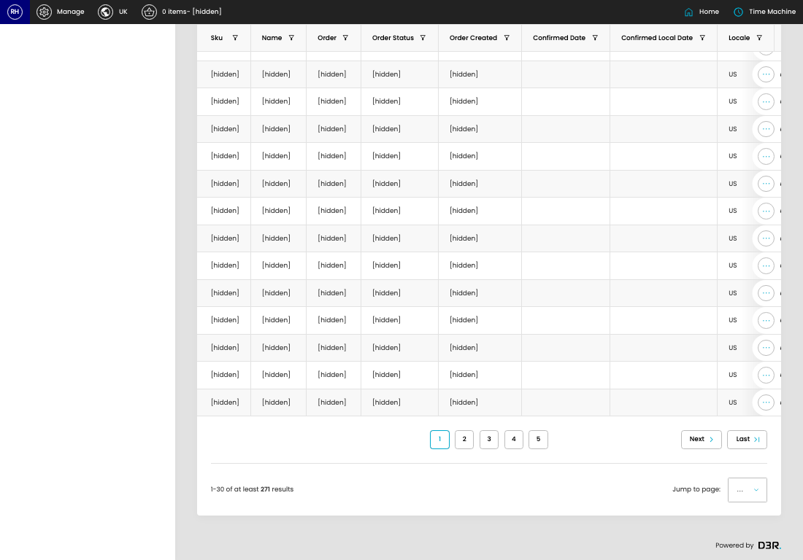

# Line Items

[Home](../../index.md) / Line Items

URL: [https://sohohome.com/cp/line-item-admin](https://sohohome.com/cp/line-item-admin)

Line Items lets admins find and review existing line items.

*Line Items page overview*

## Related Pages

- [Edit Line Item](../091-cp-line-item-admin-edit-id-cd33cb65/README.md): Open an existing line item when you need to check the setup or make a change.

## How It Works

- Makes sure the transfer property is set appropriately.

## Using This Page

1. Scan the fields in the table to find the line item you need.

## What You Can Do

### Review line items

Review the visible fields to check what already exists.

- Visible fields include Sku, Name, Order, Order Status, Order Created, Confirmed Date, Confirmed Local Date, and Locale.

## Page Sections

- All
- Open Orders
