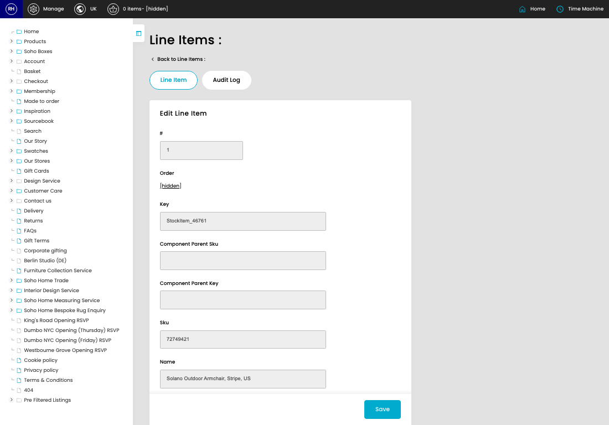

# Line Items

[Home](../../index.md) / [Line Items](../090-cp-line-item-admin-d675b4fa/README.md) / Edit Line Item

URL: [https://sohohome.com/cp/line-item-admin/edit/:id](https://sohohome.com/cp/line-item-admin/edit/:id)

Use this screen when you need to check or change an existing line item.

*Line Items page overview*

## Related Pages

- [Line Items](../090-cp-line-item-admin-d675b4fa/README.md): Review the visible fields to check what already exists.

## How It Works

- Makes sure the transfer property is set appropriately.

## Using This Page

1. Open the existing line item you need to change.
2. Work through the fields that are relevant to the change.
3. Save once the details are correct.

## What You Can Do

### Edit an existing line item

Open an existing line item when you need to check the setup or make a change.

- Save once the details are correct.

## Page Sections

- Line Item
- Audit Log
