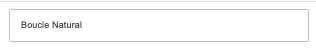
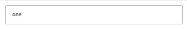
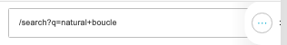

# Links

[Home](../../index.md) / Links

URL: [https://sohohome.com/cp/links-admin](https://sohohome.com/cp/links-admin)

Links covers the admin screen used to review and maintain links.

*Links page overview*

## Related Pages

- [Edit Link](../093-cp-links-admin-edit-1-6368353b/README.md): Open an existing link when you need to check the setup or make a change.

## How It Works

- The key fields are Name, From, and Url, which explain what the record is for and how it can be used.

## Using This Page

1. Open Links from the CP navigation.
2. Search or filter until you find the link you need.

## What You Can Do

### Review links

Search or filter the visible fields to find the link you need.

- Field: Name
- Field: From
- Field: Url

### Update settings

Use the fields on this screen to make the change, then save once the values are correct.

## Key Settings

The sections below highlight the settings people are most likely to change.

### listing-link-form

#### Link Name

*Link Name setting*

Set the Link Name value for each relevant row in this section.

**Validation:** Required.

#### Link Urlname

*Link Urlname setting*

Set the Link Urlname value for each relevant row in this section.

#### Link URL

*Link URL setting*

Set the Link URL value for each relevant row in this section.

**Validation:** Required.
