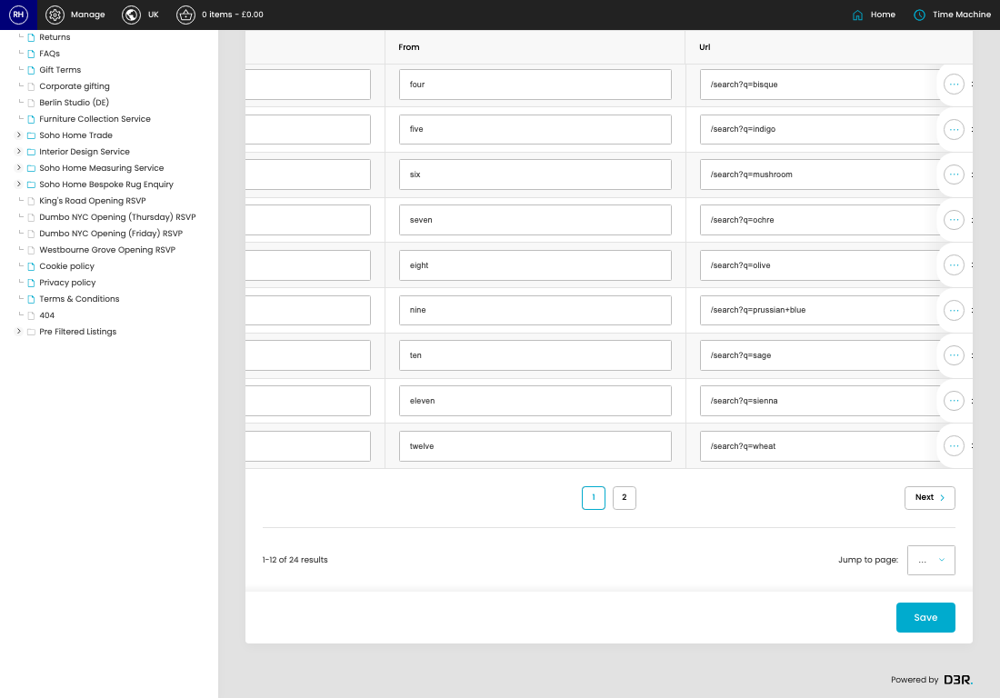

# Links

[Home](../../index.md) / Links

URL: [https://sohohome.com/cp/links-admin](https://sohohome.com/cp/links-admin)

for links Maintain a list of redirects from an urlname to an url

*Links page overview*

## Related Pages

- [Edit Link](../093-cp-links-admin-edit-id-6368353b/README.md): Open an existing link when you need to check the setup or make a change.

## How It Works

- The key fields are Name, From, and Url, which explain what the record is for and how it can be used.

## Using This Page

1. Search or filter until you find the link you need.

## What You Can Do

### Review links

Search or filter the visible fields to find the link you need.

- Visible fields include Name, From, and Url.

### Update settings

Use the fields on this screen to make the change, then save once the values are correct.
