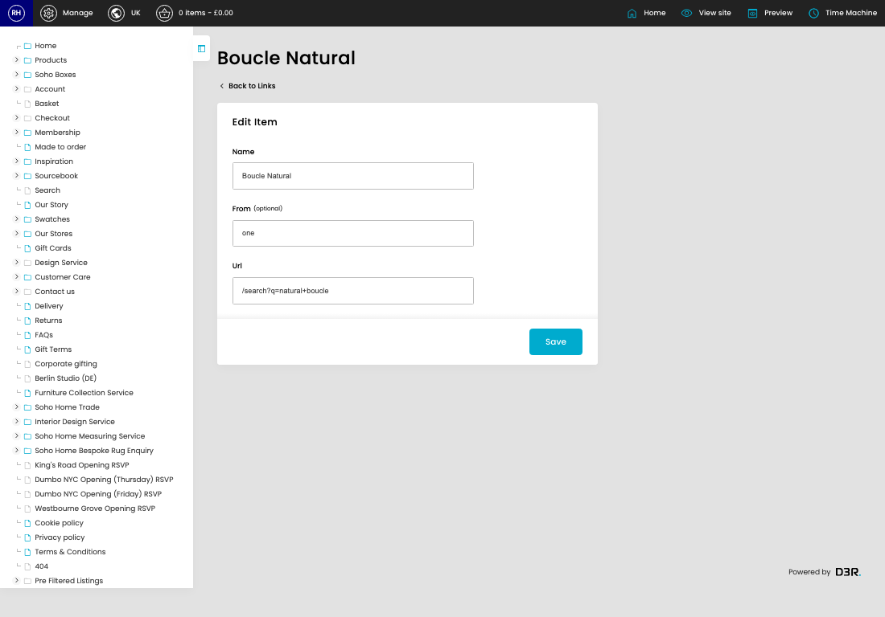
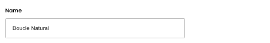
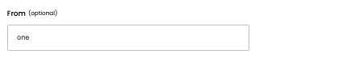
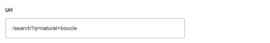

# Links

[Home](../../index.md) / [Links](../092-cp-links-admin-029534c6/README.md) / Edit Link

URL: [https://sohohome.com/cp/links-admin/edit/:id](https://sohohome.com/cp/links-admin/edit/:id)

for links Maintain a list of redirects from an urlname to an url

*Links page overview*

## Related Pages

- [Links](../092-cp-links-admin-029534c6/README.md): Search or filter the visible fields to find the link you need.

## How It Works

- The key fields are Name, From, and Url, which explain what the record is for and how it can be used.

## Using This Page

1. Open the existing link you need to change.
2. Work through the fields that are relevant to the change.
3. Save once the details are correct.

## What You Can Do

### Edit an existing link

Open an existing link when you need to check the setup or make a change.

- Save once the details are correct.

## Key Settings

### Edit Item

#### Name

*Name setting*

Add the name.

**Validation:** Required.

#### From (optional)

*From (optional) setting*

Add the from (optional).

**Notes:** optional

#### Url

*Url setting*

Add the url.

**Validation:** Required.
