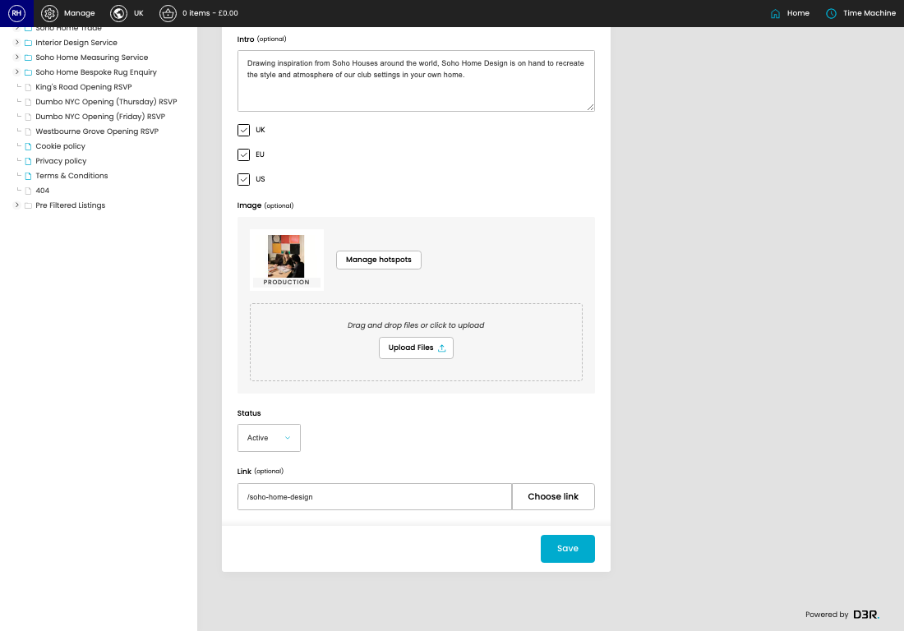
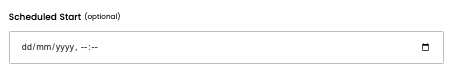
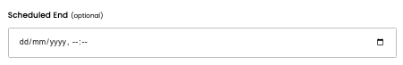
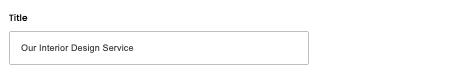
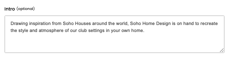
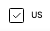
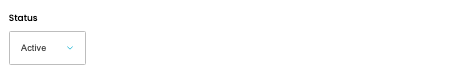

# Listing callouts

[Home](../../index.md) / Edit Listing callout

URL: [https://sohohome.com/cp/listing-callouts-admin/edit/96](https://sohohome.com/cp/listing-callouts-admin/edit/96)

Manage the listing callouts

*Listing callouts page overview*

## Related Pages

- [Listing callouts](../094-cp-listing-callouts-admin-4691ebeb/README.md): Search or filter the visible fields to find the listing callout you need.

## How It Works

- The key fields are Title, Intro, UK, EU, and US, which explain what the record is for and how it can be used.

## Using This Page

1. Open the existing listing callout you need to change.
2. Work through the fields that are relevant to the change.
3. Save once the details are correct.

## What You Can Do

### Edit an existing listing callout

Open an existing listing callout when you need to check the setup or make a change.

- Save once the details are correct.

## Key Settings

### Edit Callout

#### Scheduled Start (optional)

*Scheduled Start (optional) setting*

Add the scheduled start (optional).

**Notes:** optional

#### Scheduled End (optional)

*Scheduled End (optional) setting*

Add the scheduled end (optional).

**Notes:** optional

#### Title

*Title setting*

Add the title.

**Validation:** Required.

#### Intro (optional)

*Intro (optional) setting*

Write the intro (optional) content.

**Notes:** optional

#### UK

*UK setting*

Turn this on when UK should apply. Leave it off when it should not.

#### EU

*EU setting*

Turn this on when EU should apply. Leave it off when it should not.

#### US

*US setting*

Turn this on when US should apply. Leave it off when it should not.

#### Status

*Status setting*

Choose the option that matches this status.

**Options:** Active, Inactive

#### Link (optional)

Add the link (optional).

**Notes:** optional

## Available Actions

- Setup
- Audience
- Manage hotspots
- Upload Files
- Choose link
