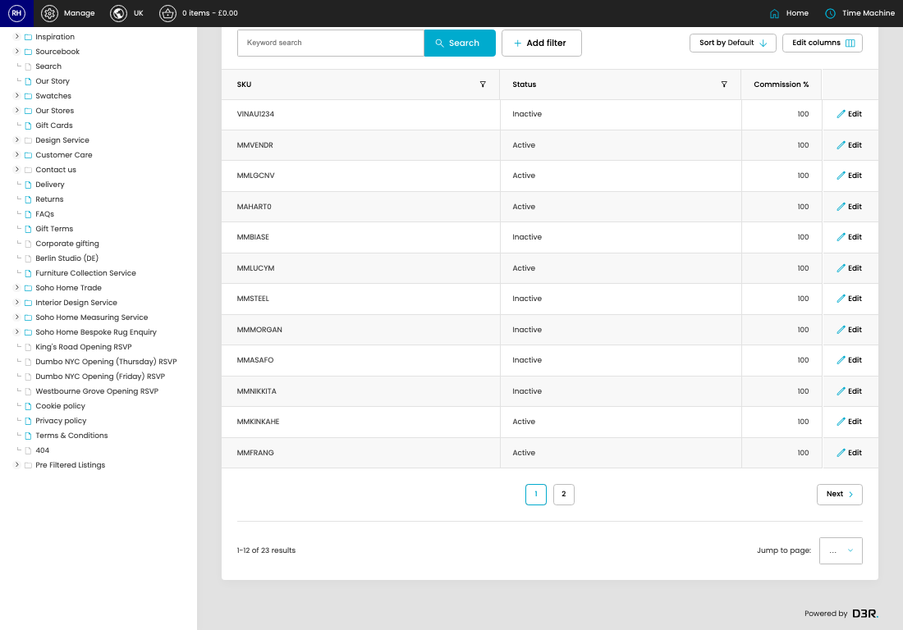

# Member Market Product Skus

[Home](../../index.md) / Member Market Product Skus

URL: [https://sohohome.com/cp/member-market-products-admin](https://sohohome.com/cp/member-market-products-admin)

Admin listing for member market products.

*Member Market Product Skus page overview*

## Related Pages

- [Edit Member Market Product Sku](../097-cp-member-market-products-admin-edit-id-4232c8a4/README.md): Open an existing member market product sku when you need to check the setup or make a change.

## How It Works

- Makes sure the transfer property is set appropriately.
- The key fields are SKU, Status, Commission %, and Tax Rate, which explain what the record is for and how it can be used.

## Using This Page

1. Search or filter until you find the member market product sku you need.

## What You Can Do

### Review member market product skus

Search or filter the visible fields to find the member market product sku you need.

- Visible fields include SKU, Status, and Commission %.

Example rows:

| SKU | Status | Commission % |
| --- | --- | --- |
| VINAU1234 | Inactive | 100 |
| MMVENDR | Active | 100 |
| MMLGCNV | Active | 100 |
