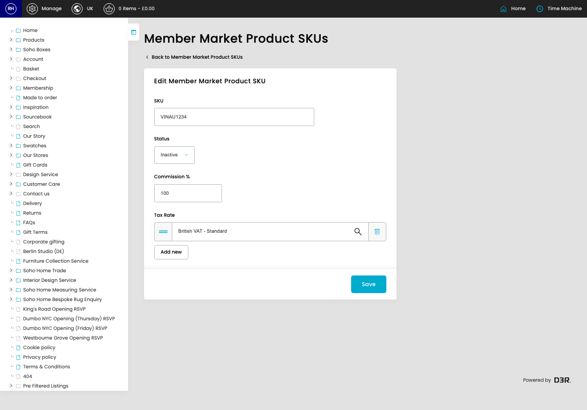

# Member Market Product Skus

[Home](../../index.md) / [Member Market Product Skus](../096-cp-member-market-products-admin-ad776172/README.md) / Edit Member Market Product SKU

URL: [https://sohohome.com/cp/member-market-products-admin/edit/:id](https://sohohome.com/cp/member-market-products-admin/edit/:id)

Admin listing for member market products.

*Member Market Product Skus page overview*

## Related Pages

- [Member Market Product Skus](../096-cp-member-market-products-admin-ad776172/README.md): Search or filter the visible fields to find the member market product sku you need.

## How It Works

- Makes sure the transfer property is set appropriately.
- The key fields are SKU, Status, Commission %, and Tax Rate, which explain what the record is for and how it can be used.

## Using This Page

1. Open the existing member market product sku you need to change.
2. Work through the fields that are relevant to the change.
3. Save once the details are correct.

## What You Can Do

### Edit an existing member market product sku

Open an existing member market product sku when you need to check the setup or make a change.

- Save once the details are correct.

## Key Settings

### Edit Member Market Product SKU

#### SKU

*SKU setting*

Add the SKU.

**Validation:** Required.

#### Status

*Status setting*

Choose the option that matches this status.

**Options:** Active, Inactive

#### Commission %

*Commission % setting*

Add the commission %.

**Validation:** Required.
