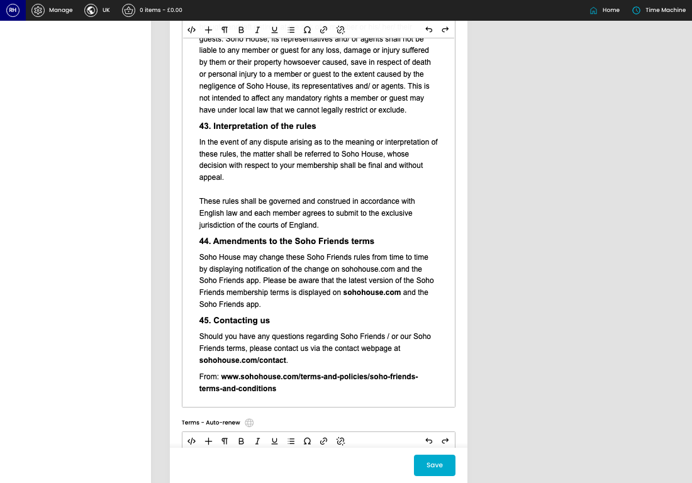

# Application Settings

[Home](../../index.md) / Application Settings

URL: [https://sohohome.com/cp/membership-application-settings-admin](https://sohohome.com/cp/membership-application-settings-admin)

Model to store config/settings for membership applications.

*Application Settings page overview*

## How It Works

- The key fields are Terms - No Auto-renew, Terms - Auto-renew, and Last Updated By, which explain what the record is for and how it can be used.

## Using This Page

1. Open the Application Settings screen.
2. Work through the fields that are relevant to the change, then save once the details are correct.

## What You Can Do

### Update settings

Use the fields on this screen to make the change, then save once the values are correct.

## Key Settings

The sections below highlight the settings people are most likely to change.

### 1. Soho Friends

#### Terms - No Auto-renew

Write the terms - no auto-renew content.

#### Terms - Auto-renew

Write the terms - auto-renew content.
