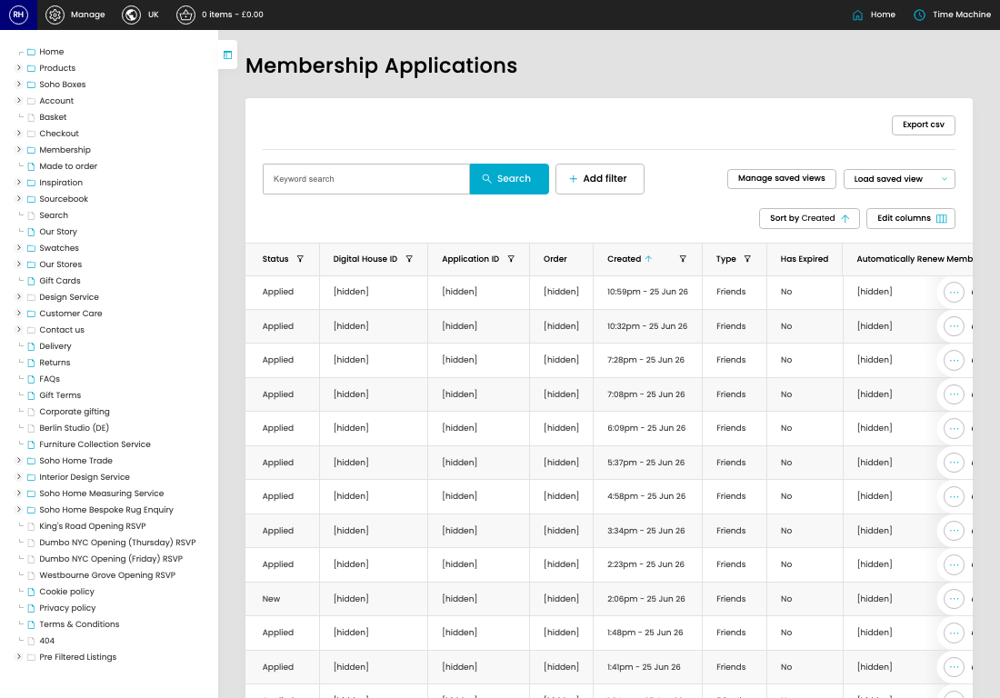

# Membership Applications

[Home](../../index.md) / Membership Applications

URL: [https://sohohome.com/cp/membership-applications](https://sohohome.com/cp/membership-applications)

Application form

*Membership Applications page overview*

## Related Pages

- [View Membership Application](../100-cp-membership-applications-view-id-a37c6faf/README.md): Open an existing membership application when you need to check the full details.

## How It Works

- Update the crystallised membership fields from DigitalHouse or our applications model.
- Sync a customer's details down from digital house.
- The key fields are Status, Digital House ID, Application ID, Order, and Last error, which explain what the record is for and how it can be used.

## Using This Page

1. Search or filter until you find the membership application you need.

## What You Can Do

### Review membership applications

Search or filter the visible fields to find the membership application you need.

- Visible fields include Status, Digital House ID, Application ID, Order, Created, Type, Has Expired, and Automatically Renew Membership?.
