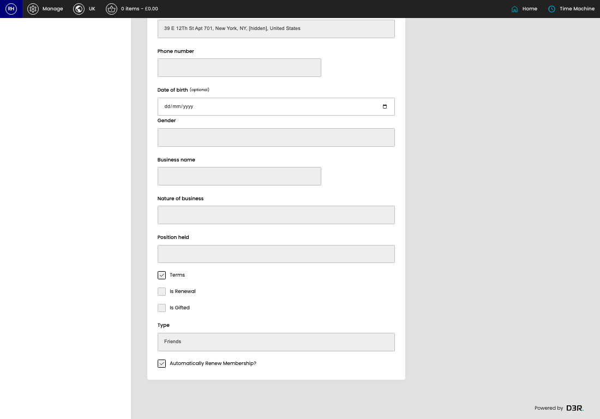
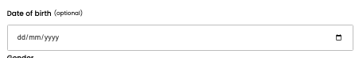

# Membership Applications

[Home](../../index.md) / [Membership Applications](../099-cp-membership-applications-272e919f/README.md) / View Membership Application

URL: [https://sohohome.com/cp/membership-applications/view/:id](https://sohohome.com/cp/membership-applications/view/:id)

Application form

*Membership Applications page overview*

## Related Pages

- [Membership Applications](../099-cp-membership-applications-272e919f/README.md): Search or filter the visible fields to find the membership application you need.

## How It Works

- Update the crystallised membership fields from DigitalHouse or our applications model.
- Sync a customer's details down from digital house.
- The key fields are Status, Digital House ID, Application ID, Order, and Last error, which explain what the record is for and how it can be used.

## Using This Page

1. Open the existing membership application you need to review.
2. Use the visible fields to check the details.

## What You Can Do

### Review an existing membership application

Open an existing membership application when you need to check the full details.

## Key Settings

### Membership Applications

#### Use Address

Turn this on when use address should apply. Leave it off when it should not.

**Notes:** Either delivery address or billing address

#### Date of birth (optional)

*Date of birth (optional) setting*

Add the date of birth (optional).

**Notes:** optional

#### Terms

Turn this on when terms should apply. Leave it off when it should not.

#### Is Renewal

Turn this on when the answer should be yes. Leave it off when it should not apply.

#### Is Gifted

Turn this on when the answer should be yes. Leave it off when it should not apply.

#### Automatically Renew Membership?

Turn this on when automatically renew membership? should apply. Leave it off when it should not.
