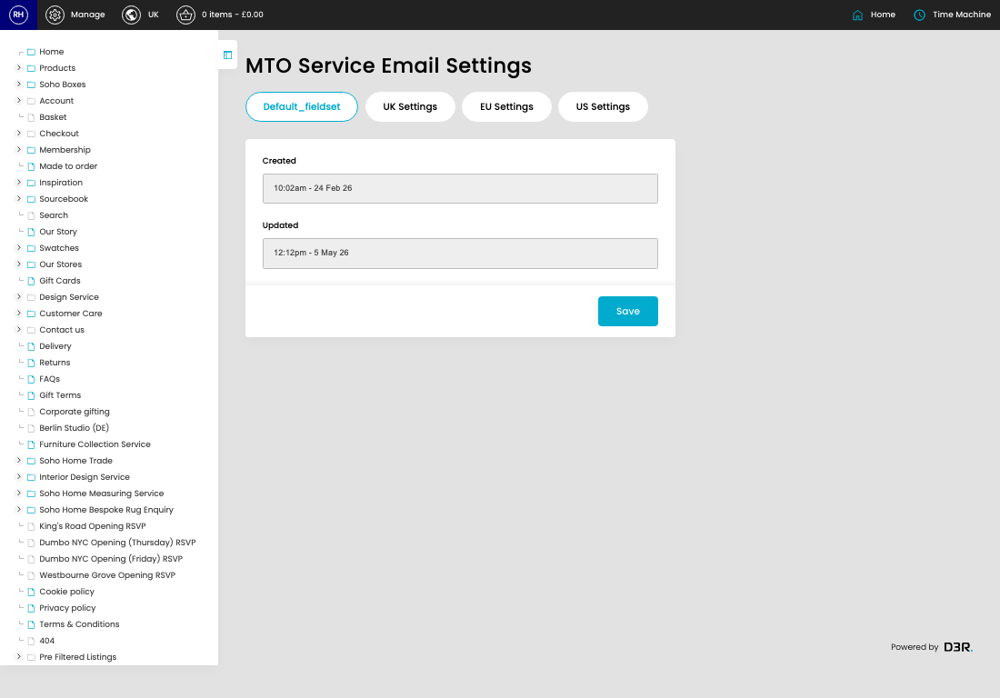

# MTO Service Email Settings

[Home](../../index.md) / MTO Service Email Settings

URL: [https://sohohome.com/cp/mto-service-email-settings-admin](https://sohohome.com/cp/mto-service-email-settings-admin)

Settings for MTO (Made-To-Order) Service Email notifications configures when and what content to send for mid-production updates

*MTO Service Email Settings page overview*

## How It Works

- Makes sure the transfer property is set appropriately.
- The key fields are Enabled, Min Lead Days, Subject, Copy, and Enabled, which explain what the record is for and how it can be used.

## Using This Page

1. Open the MTO Service Email Settings screen.
2. Work through the fields that are relevant to the change, then save once the details are correct.

## What You Can Do

### Update settings

Use the fields on this screen to make the change, then save once the values are correct.

## Page Sections

- Default_fieldset
- UK Settings
- EU Settings
- US Settings
