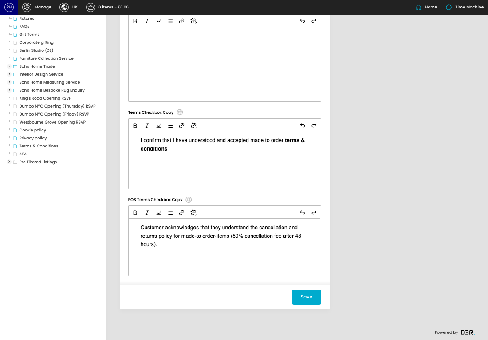
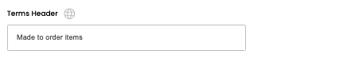

# MTO Settings

[Home](../../index.md) / MTO Settings

URL: [https://sohohome.com/cp/mto-settings-admin](https://sohohome.com/cp/mto-settings-admin)

Custom Mto Settings page

*MTO Settings page overview*

## How It Works

- Makes sure the transfer property is set appropriately.
- The key fields are POS Terms Checkbox Copy, which explain what the record is for and how it can be used.

## Using This Page

1. Open the MTO Settings screen.
2. Work through the fields that are relevant to the change, then save once the details are correct.

## What You Can Do

### Update settings

Use the fields on this screen to make the change, then save once the values are correct.

## Key Settings

### MTO Settings

#### Terms Header

*Terms Header setting*

Add the terms header.

**Validation:** Required.

#### Terms Copy

Write the terms copy content.

#### Terms Checkbox Copy

Write the terms checkbox copy content.

#### POS Terms Checkbox Copy

Write the POS terms checkbox copy content.
