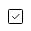

# Nav Callouts

[Home](../../index.md) / Nav Callouts

URL: [https://sohohome.com/cp/nav-callouts-admin](https://sohohome.com/cp/nav-callouts-admin)

Nav Callouts covers the admin screen used to review and maintain nav callouts.

*Nav Callouts page overview*

## Related Pages

- [Edit Nav Callout](../105-cp-nav-callouts-admin-edit-2-a40a10d3/README.md): Open an existing nav callout when you need to check the setup or make a change.

## Using This Page

1. Open Nav Callouts from the CP navigation.
2. Search or filter until you find the nav callout you need.

## What You Can Do

### Review nav callouts

Search or filter the visible fields to find the nav callout you need.

- Field: Title
- Field: URL
- Field: UK
- Field: EU
- Field: US

Example rows:

| Title | URL | UK | EU | US |
| --- | --- | --- | --- | --- |
| Add texture and warmth | /textiles/cushions |  |  |  |
| Finishing touches | /home-accessories/vases-and-planters |  |  |  |
| Inspiration for every room in your house | /inspiration/shop-the-look |  |  |  |

### Update settings

Use the fields on this screen to make the change, then save once the values are correct.

## Key Settings

The sections below highlight the settings people are most likely to change.

### listing-navcallout-form

#### Nav Callout UK

*Nav Callout UK setting*

Set the Nav Callout UK value for each relevant row in this section.

#### Nav Callout EU

*Nav Callout EU setting*

Set the Nav Callout EU value for each relevant row in this section.

#### Nav Callout US

*Nav Callout US setting*

Set the Nav Callout US value for each relevant row in this section.
