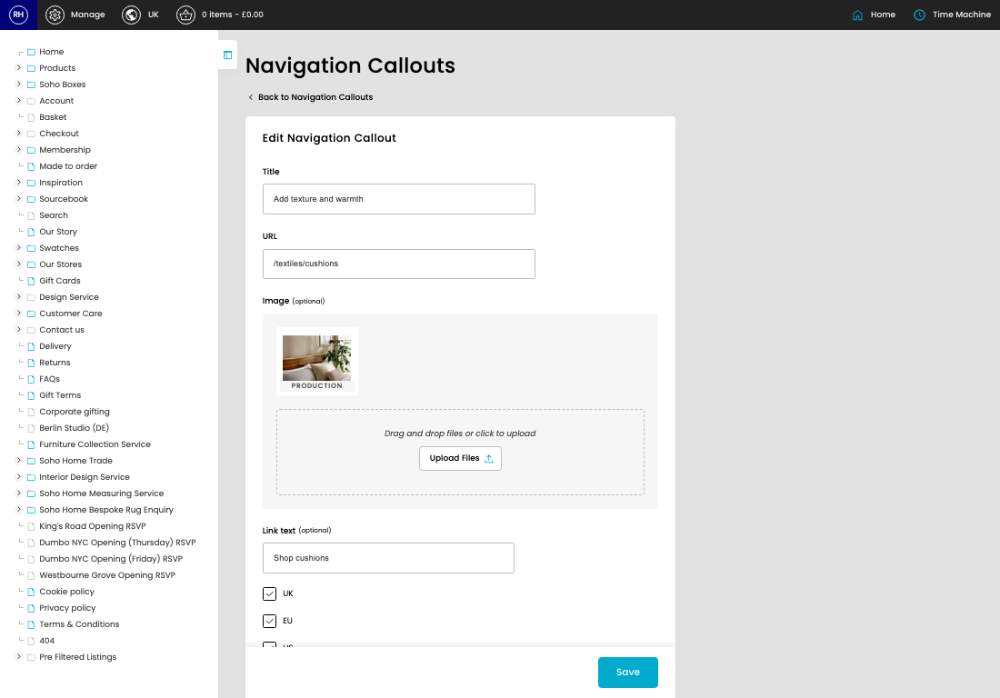
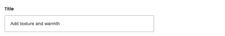
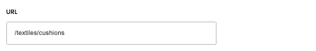
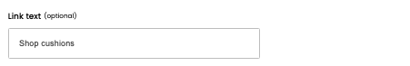

# Nav Callouts

[Home](../../index.md) / [Nav Callouts](../104-cp-nav-callouts-admin-6e8b22a3/README.md) / Edit Nav Callout

URL: [https://sohohome.com/cp/nav-callouts-admin/edit/:id](https://sohohome.com/cp/nav-callouts-admin/edit/:id)

Use this screen when you need to check or change an existing nav callout.

*Nav Callouts page overview*

## Related Pages

- [Nav Callouts](../104-cp-nav-callouts-admin-6e8b22a3/README.md): Search or filter the visible fields to find the nav callout you need.

## Using This Page

1. Open the existing nav callout you need to change.
2. Work through the fields that are relevant to the change.
3. Save once the details are correct.

## What You Can Do

### Edit an existing nav callout

Open an existing nav callout when you need to check the setup or make a change.

- Save once the details are correct.

## Key Settings

### Edit Navigation Callout

#### Title

*Title setting*

Add the title.

**Validation:** Required.

#### URL

*URL setting*

Add the URL.

**Validation:** Required.

#### Link text (optional)

*Link text (optional) setting*

Add the link text (optional).

**Notes:** optional

#### UK

Turn this on when UK should apply. Leave it off when it should not.

#### EU

Turn this on when EU should apply. Leave it off when it should not.

#### US

Turn this on when US should apply. Leave it off when it should not.

## Page Sections

- Upload Files
