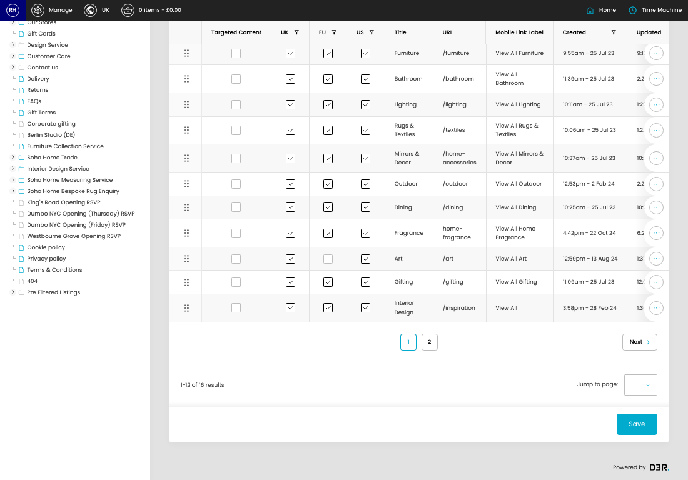
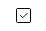
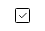
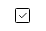

# Navigation

[Home](../../index.md) / Navigation

URL: [https://sohohome.com/cp/navigation-admin-v1](https://sohohome.com/cp/navigation-admin-v1)

Navigation lets admins find and review existing navigation.

*Navigation page overview*

## Related Pages

- [Edit Navigation](../107-cp-navigation-admin-v1-edit-1-844cb381/README.md): Open an existing navigation when you need to check the setup or make a change.

## Using This Page

1. Open Navigation from the CP navigation.
2. Scan the fields in the table to find the navigation you need.

## What You Can Do

### Review navigation

Review the visible fields to check what already exists.

- Field: Targeted Content
- Field: UK
- Field: EU
- Field: US
- Field: Title
- Field: URL
- Field: Mobile Link Label
- Field: Created
- Field: Updated

Example rows:

| Targeted Content | UK | EU | US | Title | URL |
| --- | --- | --- | --- | --- | --- |
|  |  |  |  |  | New |
|  |  |  |  |  | Furniture |
|  |  |  |  |  | Bathroom |

### Update settings

Use the fields on this screen to make the change, then save once the values are correct.

## Key Settings

The sections below highlight the settings people are most likely to change.

### listing-navigation_item-form

#### Navigation Item Targeted Content

*Navigation Item Targeted Content setting*

Set the Navigation Item Targeted Content value for each relevant row in this section.

#### Navigation Item UK

*Navigation Item UK setting*

Set the Navigation Item UK value for each relevant row in this section.

#### Navigation Item EU

*Navigation Item EU setting*

Set the Navigation Item EU value for each relevant row in this section.

#### Navigation Item US

*Navigation Item US setting*

Set the Navigation Item US value for each relevant row in this section.
