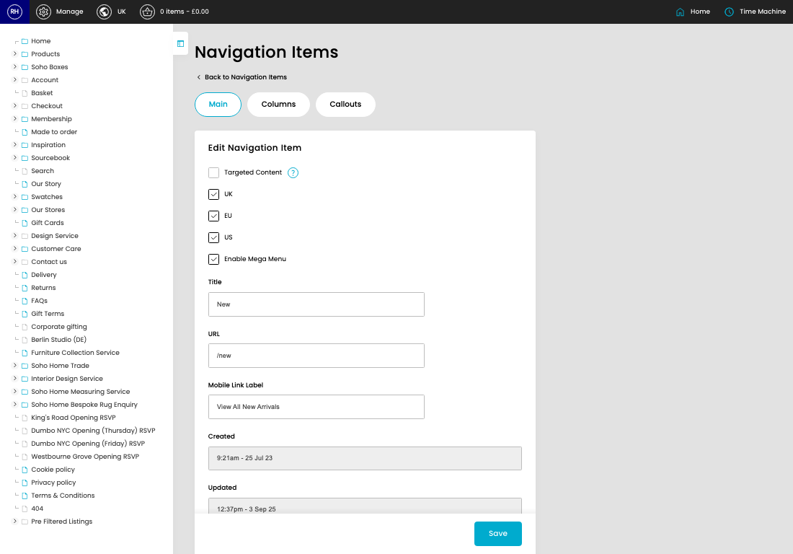
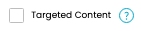
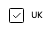
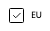
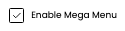
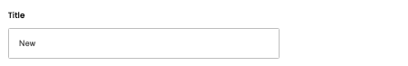

# Navigation

[Home](../../index.md) / Edit Navigation

URL: [https://sohohome.com/cp/navigation-admin-v1/edit/1](https://sohohome.com/cp/navigation-admin-v1/edit/1)

Use this screen when you need to check or change an existing navigation.

*Navigation page overview*

## Related Pages

- [Navigation](../106-cp-navigation-admin-v1-878808f3/README.md): Review the visible fields to check what already exists.

## Using This Page

1. Open the existing navigation you need to change.
2. Work through the fields that are relevant to the change.
3. Save once the details are correct.

## What You Can Do

### Edit an existing navigation

Open an existing navigation when you need to check the setup or make a change.

- Save once the details are correct.

## Key Settings

### Edit Navigation Item

#### Targeted Content

*Targeted Content setting*

Turn this on when targeted content should apply. Leave it off when it should not.

#### UK

*UK setting*

Turn this on when UK should apply. Leave it off when it should not.

#### EU

*EU setting*

Turn this on when EU should apply. Leave it off when it should not.

#### US

*US setting*

Turn this on when US should apply. Leave it off when it should not.

#### Enable Mega Menu

*Enable Mega Menu setting*

Turn this on when the answer should be yes. Leave it off when it should not apply.

#### Title

*Title setting*

Add the title.

**Validation:** Required.

#### URL

*URL setting*

Add the URL.

**Validation:** Required.

#### Mobile Link Label

*Mobile Link Label setting*

Add the mobile link label.

**Validation:** Required.

## Available Actions

- Main
- Columns
- Callouts
