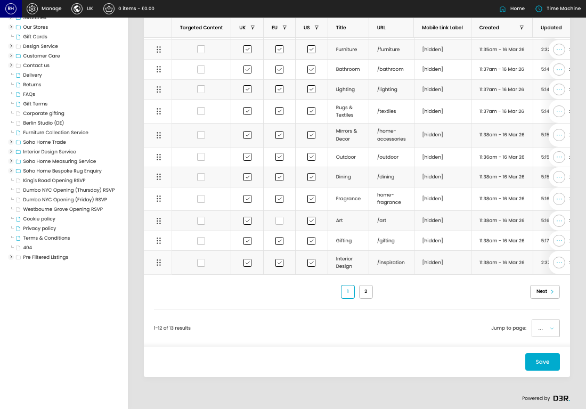

# Navigation (v2)

[Home](../../index.md) / Navigation (V2)

URL: [https://sohohome.com/cp/navigation-admin-v2](https://sohohome.com/cp/navigation-admin-v2)

Navigation (v2) lets admins find and review existing navigation (v2).

*Navigation (v2) page overview*

## Related Pages

- [Edit Navigation (v2)](../109-cp-navigation-admin-v2-edit-id-e0fadfdc/README.md): Open an existing navigation (v2) when you need to check the setup or make a change.

## Using This Page

1. Scan the fields in the table to find the navigation (v2) you need.

## What You Can Do

### Review navigation (v2)

Review the visible fields to check what already exists.

- Visible fields include Targeted Content, UK, EU, US, Title, URL, Mobile Link Label, and Created.

Example rows:

| Targeted Content | UK | EU | US | Title | URL |
| --- | --- | --- | --- | --- | --- |
|  |  |  |  |  | New |
|  |  |  |  |  | Furniture |
|  |  |  |  |  | Bathroom |

### Update settings

Use the fields on this screen to make the change, then save once the values are correct.
