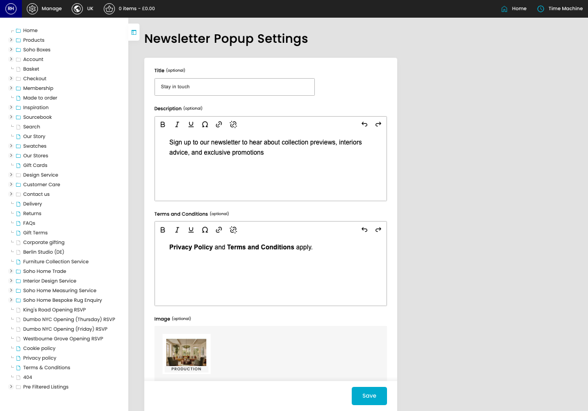
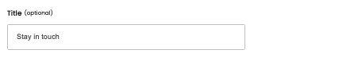

# Newsletter Popup

[Home](../../index.md) / Newsletter Popup

URL: [https://sohohome.com/cp/newsletter-popup-admin](https://sohohome.com/cp/newsletter-popup-admin)

Manage newsletter popup settings

*Newsletter Popup page overview*

## How It Works

- The key fields are Title, Description, Terms and Conditions, and Image, which explain what the record is for and how it can be used.

## Using This Page

1. Open the Newsletter Popup screen.
2. Work through the fields that are relevant to the change, then save once the details are correct.

## What You Can Do

### Update settings

Use the fields on this screen to make the change, then save once the values are correct.

## Key Settings

### Newsletter Popup Settings

#### Title (optional)

*Title (optional) setting*

Add the title (optional).

**Notes:** optional

#### Description (optional)

Write the description (optional) content.

#### Terms and Conditions (optional)

Write the terms and conditions (optional) content.

## Page Sections

- Upload Files
