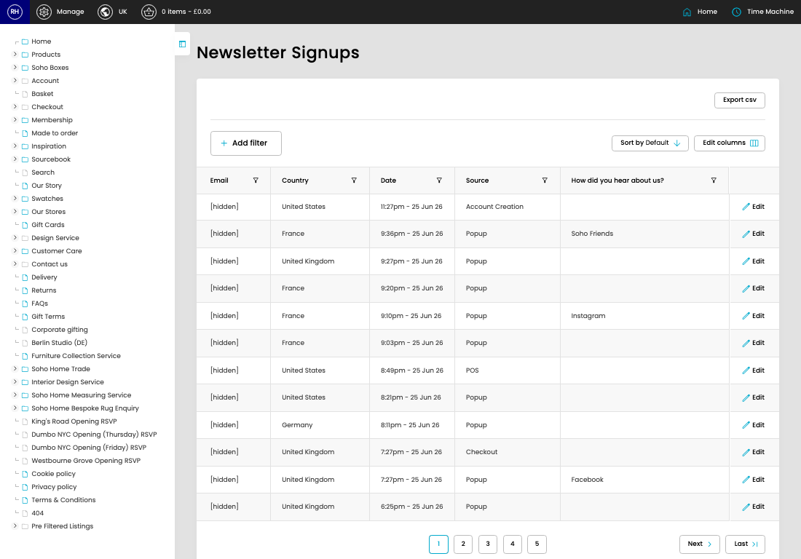

# Newsletter Signups

[Home](../../index.md) / Newsletter Signups

URL: [https://sohohome.com/cp/newsletter-signups-admin](https://sohohome.com/cp/newsletter-signups-admin)

Aspect for customer signups

*Newsletter Signups page overview*

## Related Pages

- [Edit Newsletter Signup](../112-cp-newsletter-signups-admin-edit-id-c2ef3bd2/README.md): Open an existing newsletter signup when you need to check the setup or make a change.

## How It Works

- The key fields are Email, Country, Date, Source, and How did you hear about us?, which explain what the record is for and how it can be used.

## Using This Page

1. Scan the fields in the table to find the newsletter signup you need.

## What You Can Do

### Review newsletter signups

Review the visible fields to check what already exists.

- Visible fields include Email, Country, Date, Source, and How did you hear about us?.

Example rows:

| Email | Country | Date | Source | How did you hear about us? |
| --- | --- | --- | --- | --- |
| [hidden] | United States | 11:27pm - 25 Jun 26 | Account Creation |  |
| [hidden] | France | 9:36pm - 25 Jun 26 | Popup | Soho Friends |
| [hidden] | United Kingdom | 9:27pm - 25 Jun 26 | Popup |  |
