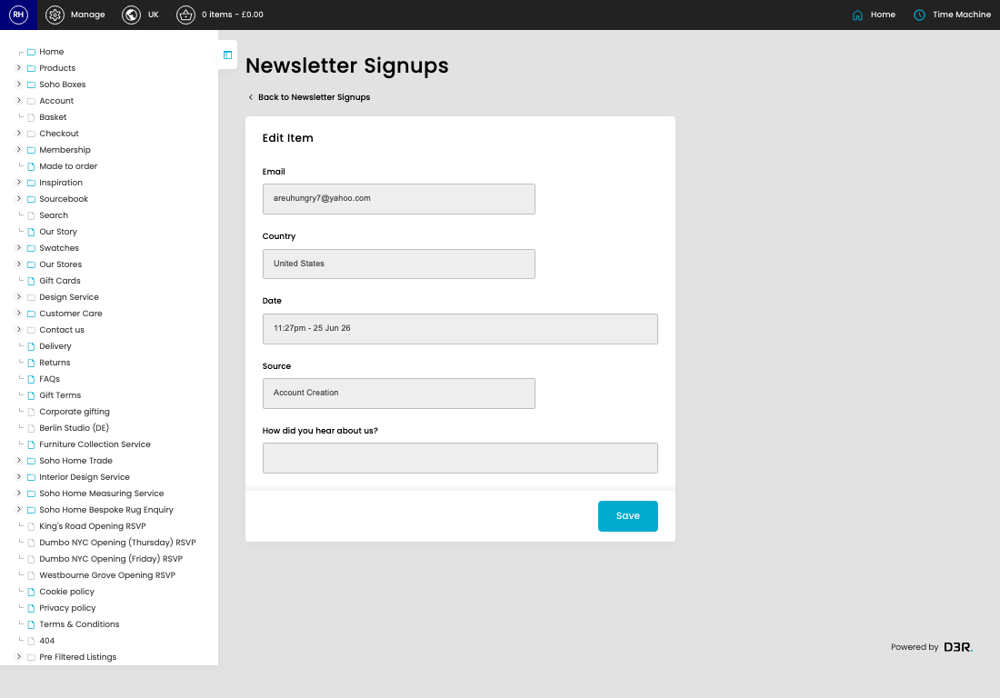

# Newsletter Signups

[Home](../../index.md) / Edit Newsletter Signup

URL: [https://sohohome.com/cp/newsletter-signups-admin/edit/491028](https://sohohome.com/cp/newsletter-signups-admin/edit/491028)

Newsletter Signups covers the admin screen used to review and maintain newsletter signups.

*Newsletter Signups page overview*

## Related Pages

- [Newsletter Signups](../111-cp-newsletter-signups-admin-e2485d69/README.md): Review the visible fields to check what already exists.

## How It Works

- The key fields are Email, Country, Date, Source, and How did you hear about us?, which explain what the record is for and how it can be used.

## Using This Page

1. Open the existing newsletter signup you need to change.
2. Work through the fields that are relevant to the change.
3. Save once the details are correct.

## What You Can Do

### Edit an existing newsletter signup

Open an existing newsletter signup when you need to check the setup or make a change.

- Save once the details are correct.
