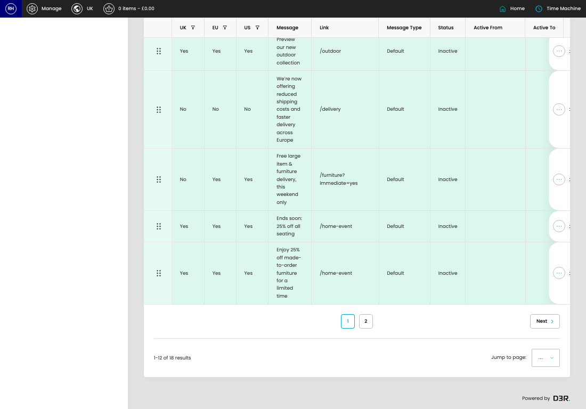

# Benefit Bar Settings

[Home](../../index.md) / Benefit Bar Settings

URL: [https://sohohome.com/cp/notice-admin](https://sohohome.com/cp/notice-admin)

Manage Notice bar settings

*Benefit Bar Settings page overview*

## Related Pages

- [Edit Benefit Bar Setting](../114-cp-notice-admin-edit-id-6d322765/README.md): Open an existing benefit bar setting when you need to check the setup or make a change.

## Using This Page

1. Search or filter until you find the benefit bar setting you need.

## What You Can Do

### Review benefit bar settings

Search or filter the visible fields to find the benefit bar setting you need.

- Visible fields include UK, EU, US, Message, Link, Message Type, Status, and Active From.

Example rows:

| UK | EU | US | Message | Link | Message Type |
| --- | --- | --- | --- | --- | --- |
|  | Yes | Yes | Yes | Further reductions: up to 40% off | /sale |
|  | No | No | Yes | Enjoy free shipping for a limited time | /new?immediate=yes |
|  | No | No | No | New collection: be the first to shop with exclusive early access | /home-event |

## Page Sections

- Default
- Membership
- View Expired Content
