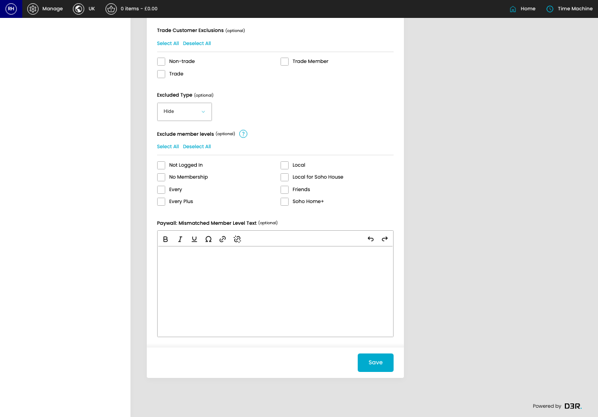
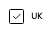
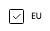
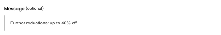
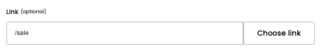
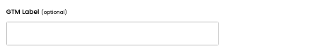
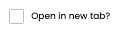
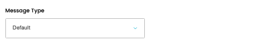

# Benefit Bar Settings

[Home](../../index.md) / Edit Benefit Bar Setting

URL: [https://sohohome.com/cp/notice-admin/edit/91](https://sohohome.com/cp/notice-admin/edit/91)

Manage Notice bar settings

*Benefit Bar Settings page overview*

## Related Pages

- [Benefit Bar Settings](../113-cp-notice-admin-f840062c/README.md): Search or filter the visible fields to find the benefit bar setting you need.

## Using This Page

1. Open the existing benefit bar setting you need to change.
2. Work through the fields that are relevant to the change.
3. Save once the details are correct.

## What You Can Do

### Edit an existing benefit bar setting

Open an existing benefit bar setting when you need to check the setup or make a change.

- Save once the details are correct.

## Key Settings

The sections below highlight the settings people are most likely to change.

### Edit Notice

#### UK

*UK setting*

Turn this on when UK should apply. Leave it off when it should not.

#### EU

*EU setting*

Turn this on when EU should apply. Leave it off when it should not.

#### US

*US setting*

Turn this on when US should apply. Leave it off when it should not.

#### Message (optional)

*Message (optional) setting*

Add the message (optional).

**Notes:** optional

#### Link (optional)

*Link (optional) setting*

Add the link (optional).

**Notes:** optional

#### GTM Label (optional)

*GTM Label (optional) setting*

Add the GTM label (optional).

**Notes:** optional

#### Open in new tab?

*Open in new tab? setting*

Turn this on when open in new tab? should apply. Leave it off when it should not.

#### Message Type

*Message Type setting*

Choose the option that matches this message type.

**Options:** Default, Membership Due (Membership In basket), Membership Overdue (Membership In basket), Membership Lapsed (Membership In basket), Membership Due, Membership Overdue, Membership Lapsed

#### Status

Choose the option that matches this status.

**Options:** Active, Inactive

#### Active From (optional)

Add the active from (optional).

**Notes:** optional

#### Active To (optional)

Add the active to (optional).

**Notes:** optional

#### Non-trade

Turn this on when non-trade should apply. Leave it off when it should not.

#### Trade

Turn this on when trade should apply. Leave it off when it should not.

#### Trade Member

Turn this on when trade member should apply. Leave it off when it should not.

#### Non-trade

Turn this on when non-trade should apply. Leave it off when it should not.

#### Trade

Turn this on when trade should apply. Leave it off when it should not.

#### Trade Member

Turn this on when trade member should apply. Leave it off when it should not.

#### Excluded Type (optional)

Choose the option that matches this excluded type (optional).

**Options:** Show Paywall, Hide

**Notes:** optional

#### Not Logged In

Turn this on when not logged in should apply. Leave it off when it should not.

#### No Membership

Turn this on when no membership should apply. Leave it off when it should not.

#### Every

Turn this on when every should apply. Leave it off when it should not.

#### Every Plus

Turn this on when every plus should apply. Leave it off when it should not.

#### Local

Turn this on when local should apply. Leave it off when it should not.

#### Local for Soho House

Turn this on when local for soho house should apply. Leave it off when it should not.

## Available Actions

- Choose link
