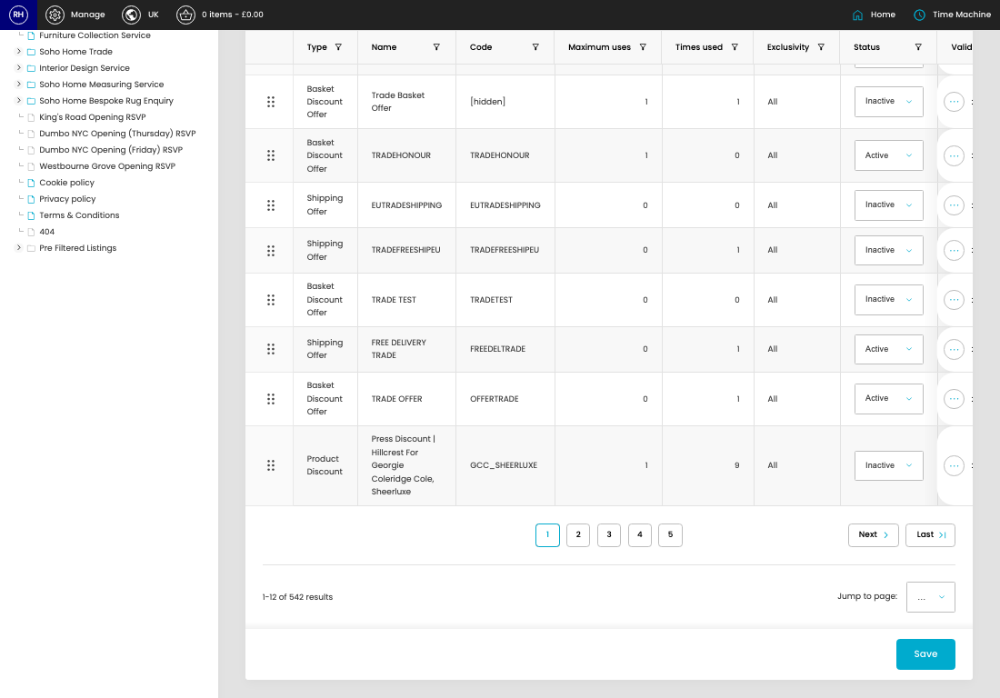

# Offers

[Home](../../index.md) / Offers

URL: [https://sohohome.com/cp/offers-admin](https://sohohome.com/cp/offers-admin)

Simple offer override

*Offers page overview*

## Related Pages

- [Edit Offer](../116-cp-offers-admin-edit-id-1b43ebef/README.md): Open an existing offer when you need to check the setup or make a change.

## How It Works

- Makes sure the transfer property is set appropriately.
- The key fields are Main Description (Reimagined), which explain what the record is for and how it can be used.

## Using This Page

1. Search or filter until you find the offer you need.

## What You Can Do

### Review offers

Search or filter the visible fields to find the offer you need.

- Visible fields include Type, Name, Code, Maximum uses, Times used, Exclusivity, Status, and Valid Currencies.

Example rows:

| Type | Name | Code | Maximum uses | Times used | Exclusivity |
| --- | --- | --- | --- | --- | --- |
|  | Product Fixed Price Discount | [hidden] | [hidden] | 1 | 2 |
|  | Basket Discount Offer | MIAMITRADE | MIAMITRADE | 5 | 2 |
|  | Product Fixed Price Discount | [hidden] | [hidden] | 1 | 0 |

### Update settings

Use the fields on this screen to make the change, then save once the values are correct.
