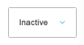

# Offers

[Home](../../index.md) / Offers

URL: [https://sohohome.com/cp/offers-admin](https://sohohome.com/cp/offers-admin)

Simple offer override

*Offers page overview*

## Related Pages

- [Edit Offer](../116-cp-offers-admin-edit-528-1b43ebef/README.md): Open an existing offer when you need to check the setup or make a change.

## How It Works

- Makes sure the transfer property is set appropriately.
- The key fields are Main Description (Reimagined), which explain what the record is for and how it can be used.

## Using This Page

1. Open Offers from the CP navigation.
2. Search or filter until you find the offer you need.

## What You Can Do

### Review offers

Search or filter the visible fields to find the offer you need.

- Field: Type
- Field: Name
- Field: Code
- Field: Maximum uses
- Field: Times used
- Field: Exclusivity
- Field: Status
- Field: Valid Currencies
- Field: Membership Renewals only
- Field: Member only
- Field: Exclude members
- Field: Exclude Trade Tiers

Example rows:

| Type | Name | Code | Maximum uses | Times used | Exclusivity |
| --- | --- | --- | --- | --- | --- |
|  | Product Fixed Price Discount | S251110173171I | S251110173171I | 1 | 2 |
|  | Basket Discount Offer | MIAMITRADE | MIAMITRADE | 5 | 2 |
|  | Product Fixed Price Discount | S2512150845N33 | S2512150845N33 | 1 | 0 |

### Update settings

Use the fields on this screen to make the change, then save once the values are correct.

## Key Settings

The sections below highlight the settings people are most likely to change.

### listing-offers_offer-form

#### Offer Status

*Offer Status setting*

Set the Offer Status value for each relevant row in this section.

**Options:** Active, Inactive
