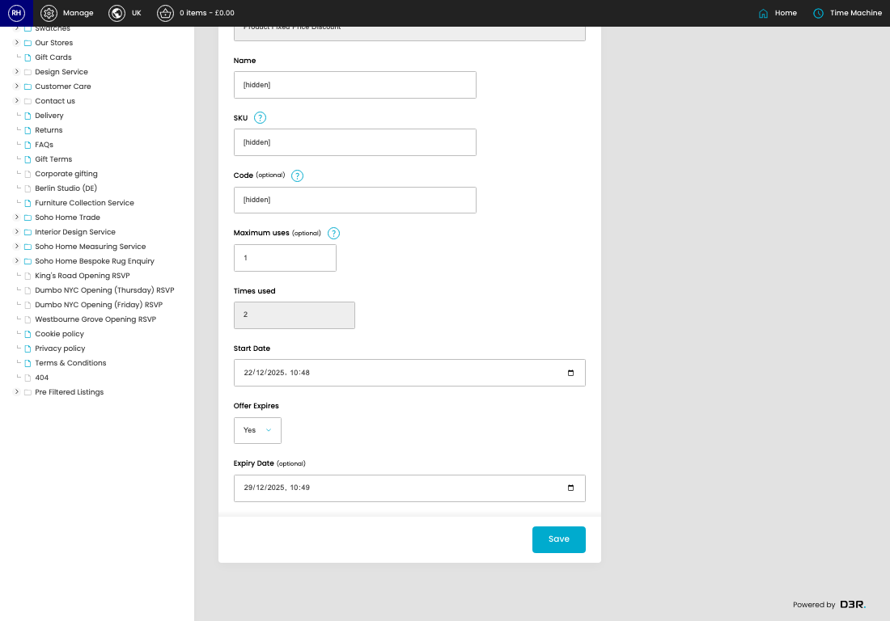
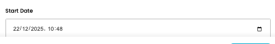
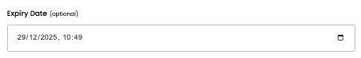

# Offers

[Home](../../index.md) / [Offers](../115-cp-offers-admin-90a65ebe/README.md) / Edit Offer

URL: [https://sohohome.com/cp/offers-admin/edit/:id](https://sohohome.com/cp/offers-admin/edit/:id)

Simple offer override

*Offers page overview*

## Related Pages

- [Offers](../115-cp-offers-admin-90a65ebe/README.md): Search or filter the visible fields to find the offer you need.

## How It Works

- Makes sure the transfer property is set appropriately.
- The key fields are Main Description (Reimagined), which explain what the record is for and how it can be used.

## Using This Page

1. Open the existing offer you need to change.
2. Work through the fields that are relevant to the change.
3. Save once the details are correct.

## What You Can Do

### Edit an existing offer

Open an existing offer when you need to check the setup or make a change.

- Save once the details are correct.

## Key Settings

### Edit Offer

#### Name

*Name setting*

Add the name.

**Validation:** Required.

#### SKU

*SKU setting*

Add the SKU.

**Validation:** Required.

#### Code (optional)

*Code (optional) setting*

Add the code (optional).

**Notes:** optional

#### Maximum uses (optional)

*Maximum uses (optional) setting*

Add the maximum uses (optional).

**Notes:** optional

#### Start Date

*Start Date setting*

Add the start date.

#### Offer Expires

*Offer Expires setting*

Choose the option that matches this offer expires.

**Options:** No, Yes

#### Expiry Date (optional)

*Expiry Date (optional) setting*

Add the expiry date (optional).

**Notes:** optional

## Page Sections

- Main
- Rule
- Users
- Additional
- Audit Log
