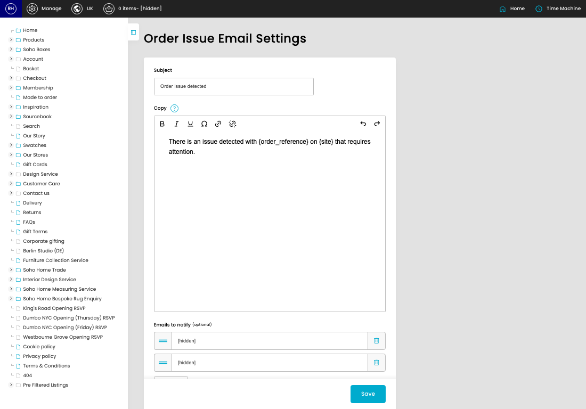
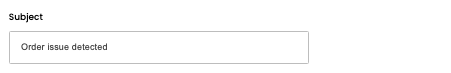
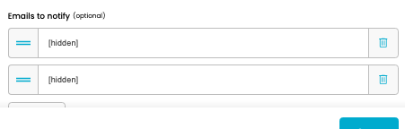
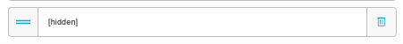

# Order Issue Email Settings

[Home](../../index.md) / Order Issue Email Settings

URL: [https://sohohome.com/cp/order-issue-email-settings-admin](https://sohohome.com/cp/order-issue-email-settings-admin)

Internal email notifications for order issues.

*Order Issue Email Settings page overview*

## How It Works

- Makes sure the transfer property is set appropriately.
- The key fields are Subject, Copy, and Emails to notify, which explain what the record is for and how it can be used.

## Using This Page

1. Open the Order Issue Email Settings screen.
2. Work through the fields that are relevant to the change, then save once the details are correct.

## What You Can Do

### Update settings

Use the fields on this screen to make the change, then save once the values are correct.

## Key Settings

### Order Issue Email Settings

#### Subject

*Subject setting*

Add the subject.

**Validation:** Required.

#### Copy

Write the copy content.

**Notes:** `{site}` and `{order_reference}` is available for dynamic copy replacement

#### setting_emails[0][]

*setting_emails[0][] setting*

Add the setting_emails[0][].

#### setting_emails[1][]

*setting_emails[1][] setting*

Add the setting_emails[1][].
