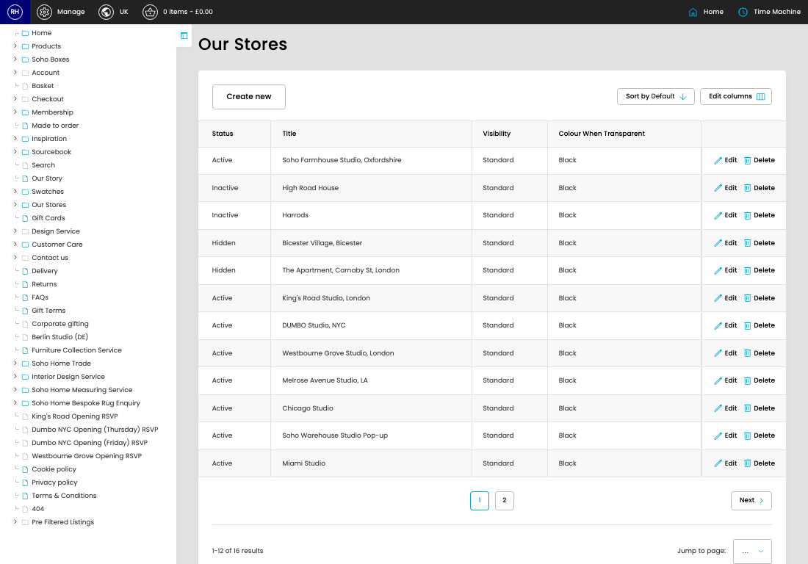

# Our Stores

[Home](../../index.md) / Our Stores

URL: [https://sohohome.com/cp/our-stores-admin](https://sohohome.com/cp/our-stores-admin)

Our Stores lets admins find and review existing our stores.

*Our Stores page overview*

## Related Pages

- [Create Our Store](../119-cp-our-stores-admin-edit-new-653150fc/README.md): Use Create new when this our store does not already exist. Complete the fields that describe it, then save.

## How It Works

- The key fields are Title, Intro, Address, URL Name, and Simplybook ID, which explain what the record is for and how it can be used.

## Using This Page

1. Scan the fields in the table to find the our store you need.

## What You Can Do

### Review our stores

Review the visible fields to check what already exists.

- Visible fields include Status, Title, Visibility, and Colour When Transparent.

Example rows:

| Status | Title | Visibility | Colour When Transparent |
| --- | --- | --- | --- |
| Active | Soho Farmhouse Studio, Oxfordshire | Standard | Black |
| Inactive | High Road House | Standard | Black |
| Inactive | Harrods | Standard | Black |
