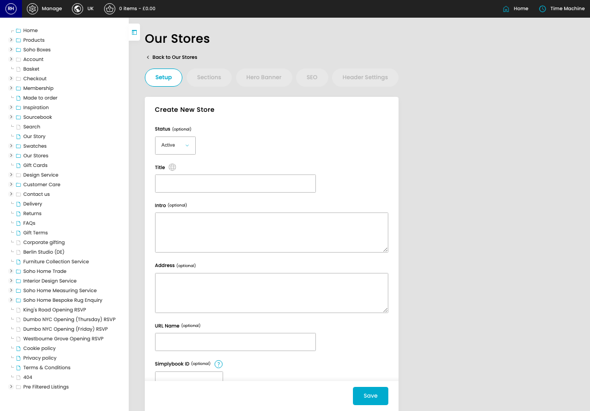
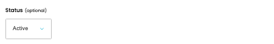
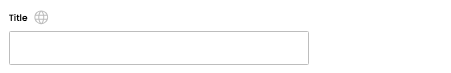
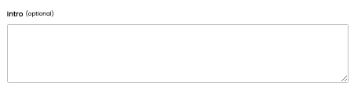
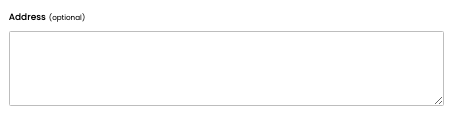
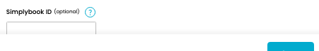

# Our Stores

[Home](../../index.md) / Create Our Store

URL: [https://sohohome.com/cp/our-stores-admin/edit/new](https://sohohome.com/cp/our-stores-admin/edit/new)

Controller for our stores section

*Our Stores page overview*

## Related Pages

- [Our Stores](../118-cp-our-stores-admin-11c8ca6d/README.md): Review the visible fields to check what already exists.

## How It Works

- The key fields are Title, Intro, Address, URL Name, and Simplybook ID, which explain what the record is for and how it can be used.

## Using This Page

1. Create the new our store from this screen.
2. Work through the fields that are relevant to the new record.
3. Save once the details are correct.

## What You Can Do

### Create a new our store

Use Create new when this our store does not already exist. Complete the fields that describe it, then save.

### Update settings

Use the fields on this screen to make the change, then save once the values are correct.

## Key Settings

### Create New Store

#### Status (optional)

*Status (optional) setting*

Choose the option that matches this status (optional).

**Options:** Active, Hidden, Inactive

**Notes:** optional

#### Title

*Title setting*

Add the title.

**Validation:** Required.

#### Intro (optional)

*Intro (optional) setting*

Write the intro (optional) content.

**Notes:** optional

#### Address (optional)

*Address (optional) setting*

Write the address (optional) content.

**Notes:** optional

#### URL Name (optional)

*URL Name (optional) setting*

Add the URL name (optional).

**Notes:** optional

#### Simplybook ID (optional)

*Simplybook ID (optional) setting*

Add the simplybook ID (optional).

**Notes:** The ID of the store in Simplybook, used for interior design bookings.

## Available Actions

- Setup
