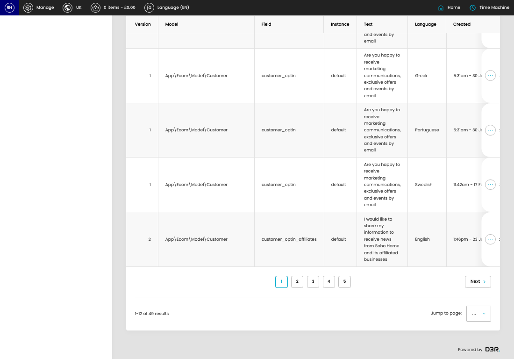

# Permission Labels

[Home](../../index.md) / Permission Labels

URL: [https://sohohome.com/cp/permissions-label-admin](https://sohohome.com/cp/permissions-label-admin)

Implement custom template for permissions field

*Permission Labels page overview*

## Related Pages

- [Edit Permission Label](../122-cp-permissions-label-admin-edit-id-780f40e1/README.md): Open an existing permission label when you need to check the setup or make a change.

## How It Works

- The key fields are Language, which explain what the record is for and how it can be used.

## Using This Page

1. Scan the fields in the table to find the permission label you need.

## What You Can Do

### Review permission labels

Review the visible fields to check what already exists.

- Visible fields include Version, Model, Field, Instance, Text, Language, Created, and Updated.

Example rows:

| Version | Model | Field | Instance | Text | Language |
| --- | --- | --- | --- | --- | --- |
| 1 | App\Content\Contact\Model\Enquiry | enquiry_optin | default | Are you happy to receive marketing communications, exclusive offers and events by email | English |
| 1 | App\Ecom\Model\Customer | customer_optin | default | Are you happy to receive marketing communications, exclusive offers and events by email | English |
| 1 | App\Ecom\Model\Customer | customer_optin | default | Are you happy to receive marketing communications, exclusive offers and events by email | Danish |
