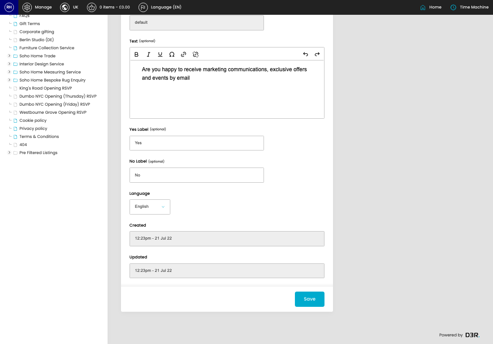
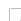
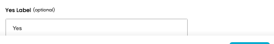
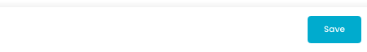
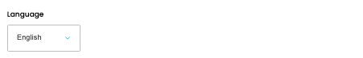

# Permission Labels

[Home](../../index.md) / Edit Permission Label

URL: [https://sohohome.com/cp/permissions-label-admin/edit/18](https://sohohome.com/cp/permissions-label-admin/edit/18)

Implement custom template for permissions field

*Permission Labels page overview*

## Related Pages

- [Permission Labels](../121-cp-permissions-label-admin-19ecf6a4/README.md): Review the visible fields to check what already exists.

## How It Works

- The key fields are Language, which explain what the record is for and how it can be used.

## Using This Page

1. Open the existing permission label you need to change.
2. Work through the fields that are relevant to the change.
3. Save once the details are correct.

## What You Can Do

### Edit an existing permission label

Open an existing permission label when you need to check the setup or make a change.

- Save once the details are correct.

## Key Settings

### Edit Label

#### Text (optional)

*Text (optional) setting*

Write the text (optional) content.

#### Yes Label (optional)

*Yes Label (optional) setting*

Add the yes label (optional).

**Notes:** optional

#### No Label (optional)

*No Label (optional) setting*

Add the no label (optional).

**Notes:** optional

#### Language

*Language setting*

Choose the option that matches this language.

**Options:** Danish, Dutch, English, French, German, Greek, Italian, Portuguese, Spanish, Swedish
