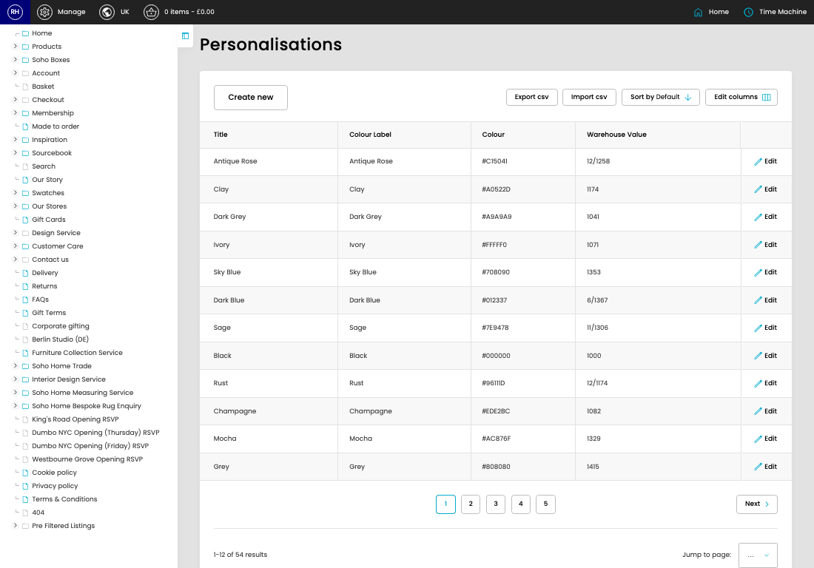

# Personalisations

[Home](../../index.md) / Personalisations

URL: [https://sohohome.com/cp/personalisation-admin](https://sohohome.com/cp/personalisation-admin)

Personalisations covers the admin screen used to review and maintain personalisations.

*Personalisations page overview*

## Related Pages

- [Edit Personalisation](../124-cp-personalisation-admin-edit-1-7a43e9d7/README.md): Open an existing personalisation when you need to check the setup or make a change.

## How It Works

- After this has been updated.
- Refresh Action.
- The key fields are Title, Colour Label, Colour, and Warehouse Value, which explain what the record is for and how it can be used.

## Using This Page

1. Open Personalisations from the CP navigation.
2. Scan the fields in the table to find the personalisation you need.

## What You Can Do

### Review personalisations

Review the visible fields to check what already exists.

- Field: Title
- Field: Colour Label
- Field: Colour
- Field: Warehouse Value

Example rows:

| Title | Colour Label | Colour | Warehouse Value |
| --- | --- | --- | --- |
| Antique Rose | Antique Rose | #C15041 | 12/1258 |
| Clay | Clay | #A0522D | 1174 |
| Dark Grey | Dark Grey | #A9A9A9 | 1041 |

## Available Actions

- Import csv
