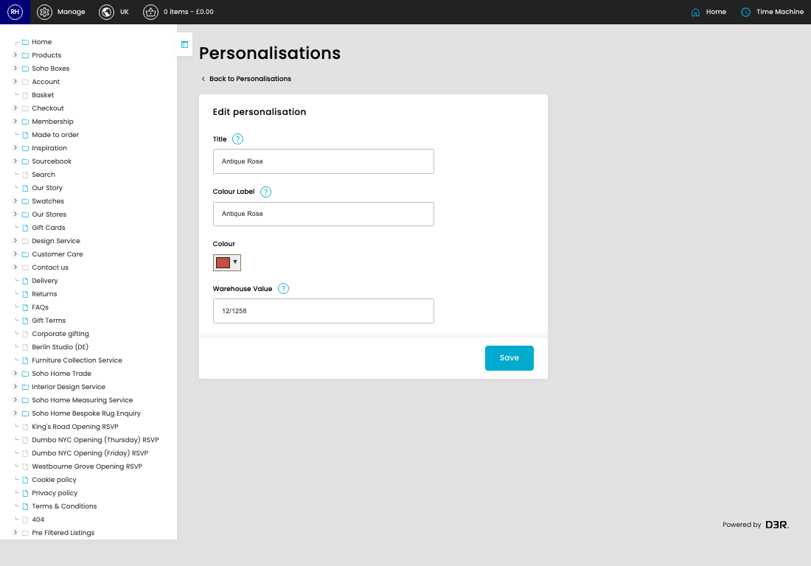
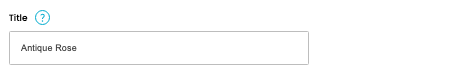
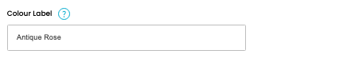
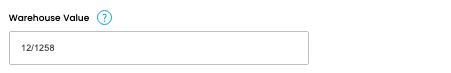

# Personalisations

[Home](../../index.md) / Edit Personalisation

URL: [https://sohohome.com/cp/personalisation-admin/edit/1](https://sohohome.com/cp/personalisation-admin/edit/1)

Personalisations covers the admin screen used to review and maintain personalisations.

*Personalisations page overview*

## Related Pages

- [Personalisations](../123-cp-personalisation-admin-219a882c/README.md): Review the visible fields to check what already exists.

## How It Works

- After this has been updated.
- Refresh Action.
- The key fields are Title, Colour Label, Colour, and Warehouse Value, which explain what the record is for and how it can be used.

## Using This Page

1. Open the existing personalisation you need to change.
2. Work through the fields that are relevant to the change.
3. Save once the details are correct.

## What You Can Do

### Edit an existing personalisation

Open an existing personalisation when you need to check the setup or make a change.

- Save once the details are correct.

## Key Settings

### Edit personalisation

#### Title

*Title setting*

Add the title.

**Validation:** Required.

**Notes:** Internal description

#### Colour Label

*Colour Label setting*

Add the colour label.

**Validation:** Required.

**Notes:** Presented on the front end option

#### Warehouse Value

*Warehouse Value setting*

Add the warehouse value.

**Validation:** Required.

**Notes:** Value that is sent to the warehouse
