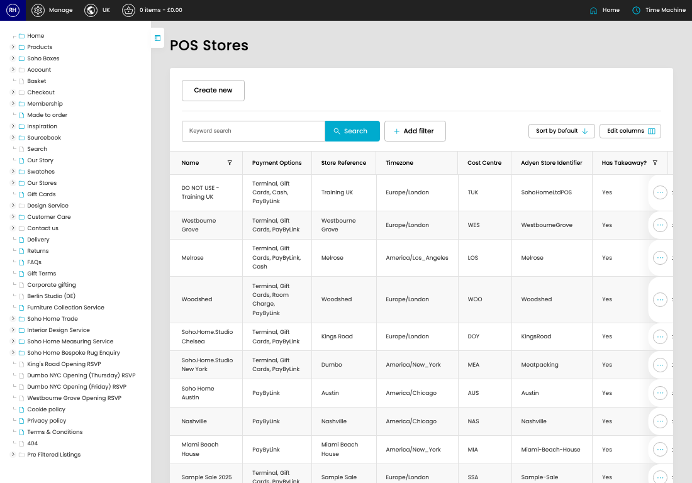

# Stores

[Home](../../index.md) / Stores

URL: [https://sohohome.com/cp/pos-store-admin](https://sohohome.com/cp/pos-store-admin)

Controller for listing and managing POS stores

*Stores page overview*

## Related Pages

- [Edit Store](../126-cp-pos-store-admin-edit-1-204da51b/README.md): Review what already exists, then open a row when a change is needed.

## Using This Page

1. Open Stores from the CP navigation.
2. Search or filter until you find the store you need.

## What You Can Do

### Review stores

Search or filter the visible fields to find the store you need.

- Field: Name
- Field: Payment Options
- Field: Store Reference
- Field: Timezone
- Field: Cost Centre
- Field: Adyen Store Identifier
- Field: Has Takeaway?
- Field: Is Outlet
- Field: Line 1
- Field: Town
- Field: Postcode
- Field: Country

Example rows:

| Name | Payment Options | Store Reference | Timezone | Cost Centre | Adyen Store Identifier |
| --- | --- | --- | --- | --- | --- |
| DO NOT USE - Training UK | Terminal, Gift Cards, Cash, PayByLink | Training UK | Europe/London | TUK | SohoHomeLtdPOS |
| Westbourne Grove | Terminal, Gift Cards, PayByLink | Westbourne Grove | Europe/London | WES | WestbourneGrove |
| Melrose | Terminal, Gift Cards, PayByLink, Cash | Melrose | America/Los_Angeles | LOS | Melrose |
