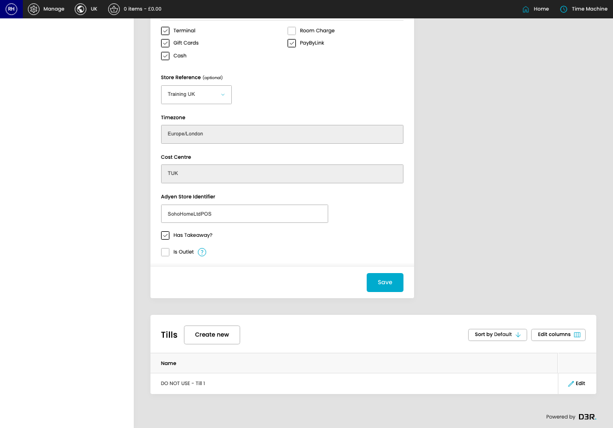
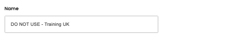
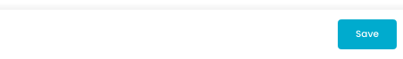

# Stores

[Home](../../index.md) / Edit Store

URL: [https://sohohome.com/cp/pos-store-admin/edit/1](https://sohohome.com/cp/pos-store-admin/edit/1)

Controller for listing and managing POS stores

*Stores page overview*

## Related Pages

- [Stores](../125-cp-pos-store-admin-53f57f75/README.md): Search or filter the visible fields to find the store you need.

## Using This Page

1. Open Stores from the CP navigation.
2. Scan the fields in the table to find the store you need.
3. Open a row when you need to check the details or make a change.

## What You Can Do

### Review stores

Review what already exists, then open a row when a change is needed.

- Field: Name

Example rows:

| Name |
| --- |
| DO NOT USE - Till 1 |

### Edit an existing store

Open an existing store when you need to check the setup or make a change.

- Save once the details are correct.

## Key Settings

### Edit Store

#### Name

*Name setting*

Add the name.

**Validation:** Required.

#### Returns Policy

*Returns Policy setting*

Write the returns policy content.

#### Business Number

*Business Number setting*

Add the business number.

**Validation:** Required.

#### Terminal

*Terminal setting*

Turn this on when terminal should apply. Leave it off when it should not.

#### Gift Cards

*Gift Cards setting*

Turn this on when gift cards should apply. Leave it off when it should not.

#### Cash

*Cash setting*

Turn this on when cash should apply. Leave it off when it should not.

#### Room Charge

*Room Charge setting*

Turn this on when room charge should apply. Leave it off when it should not.

#### PayByLink

*PayByLink setting*

Turn this on when paybylink should apply. Leave it off when it should not.

#### Store Reference (optional)

Choose the option that matches this store reference (optional).

**Options:** Amsterdam, Austin, Bicester, Berlin, Carnaby, Chicago Studio, Dumbo, Kings Road, Melrose, Miami Beach House, Nashville, Rome, and 7 more

**Notes:** optional

#### Adyen Store Identifier

Add the adyen store identifier.

**Validation:** Required.

#### Has Takeaway?

Turn this on when the answer should be yes. Leave it off when it should not apply.

#### Is Outlet

Turn this on when the answer should be yes. Leave it off when it should not apply.

## Available Actions

- Main
- Address
