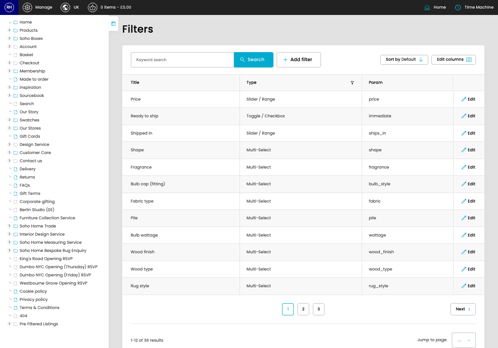

# Filters

[Home](../../index.md) / Filters

URL: [https://sohohome.com/cp/product-filters-admin](https://sohohome.com/cp/product-filters-admin)

Filters covers the admin screen used to review and maintain filters.

*Filters page overview*

## Related Pages

- [Edit Filter](../128-cp-product-filters-admin-edit-1-00904b24/README.md): Open an existing filter when you need to check the setup or make a change.

## Using This Page

1. Open Filters from the CP navigation.
2. Search or filter until you find the filter you need.

## What You Can Do

### Review filters

Search or filter the visible fields to find the filter you need.

- Field: Title
- Field: Type
- Field: Param

Example rows:

| Title | Type | Param |
| --- | --- | --- |
| Price | Slider / Range | price |
| Ready to ship | Toggle / Checkbox | immediate |
| Shipped in | Slider / Range | ships_in |
