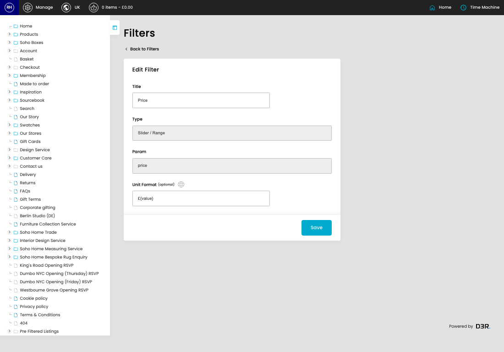
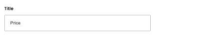
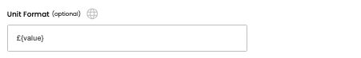

# Filters

[Home](../../index.md) / [Filters](../127-cp-product-filters-admin-9d7642a0/README.md) / Edit Filter

URL: [https://sohohome.com/cp/product-filters-admin/edit/:id](https://sohohome.com/cp/product-filters-admin/edit/:id)

Product filter

*Filters page overview*

## Related Pages

- [Filters](../127-cp-product-filters-admin-9d7642a0/README.md): Search or filter the visible fields to find the filter you need.

## Using This Page

1. Open the existing filter you need to change.
2. Work through the fields that are relevant to the change.
3. Save once the details are correct.

## What You Can Do

### Edit an existing filter

Open an existing filter when you need to check the setup or make a change.

- Save once the details are correct.

## Key Settings

### Edit Filter

#### Title

*Title setting*

Add the title.

**Validation:** Required.

#### Unit Format (optional)

*Unit Format (optional) setting*

Add the unit format (optional).

**Notes:** optional
