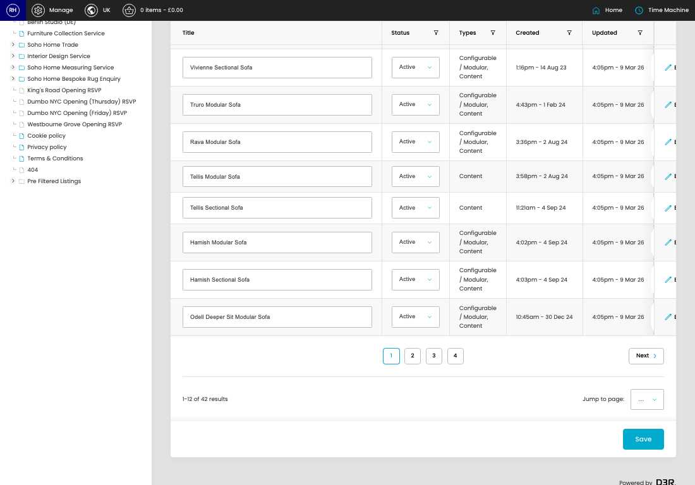
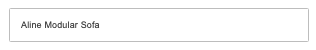
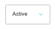

# Groups

[Home](../../index.md) / Groups

URL: [https://sohohome.com/cp/product-groups-admin](https://sohohome.com/cp/product-groups-admin)

Groups covers the admin screen used to review and maintain groups.

*Groups page overview*

## Related Pages

- [Edit Group](../130-cp-product-groups-admin-edit-1-8a8e887d/README.md): Open an existing group when you need to check the setup or make a change.

## How It Works

- After this has been updated.
- Refresh Action.
- The key fields are Description (Reimagined), Badge, Title, Intro, and Items, which explain what the record is for and how it can be used.

## Using This Page

1. Open Groups from the CP navigation.
2. Search or filter until you find the group you need.

## What You Can Do

### Review groups

Search or filter the visible fields to find the group you need.

- Field: Title
- Field: Status
- Field: Types
- Field: Created
- Field: Updated

Example rows:

| Title | Status | Types | Created | Updated |
| --- | --- | --- | --- | --- |
|  | Active Inactive | Configurable / Modular, Content | 3:17pm - 28 Feb 23 | 4:05pm - 9 Mar 26 |
|  | Active Inactive | Configurable / Modular, Content | 3:17pm - 28 Feb 23 | 4:05pm - 9 Mar 26 |
|  | Active Inactive | Configurable / Modular, Content | 3:17pm - 28 Feb 23 | 4:05pm - 9 Mar 26 |

### Update settings

Use the fields on this screen to make the change, then save once the values are correct.

## Key Settings

The sections below highlight the settings people are most likely to change.

### listing-product_group-form

#### Group Title

*Group Title setting*

Set the Group Title value for each relevant row in this section.

**Validation:** Required.

#### Group Status

*Group Status setting*

Set the Group Status value for each relevant row in this section.

**Options:** Active, Inactive
