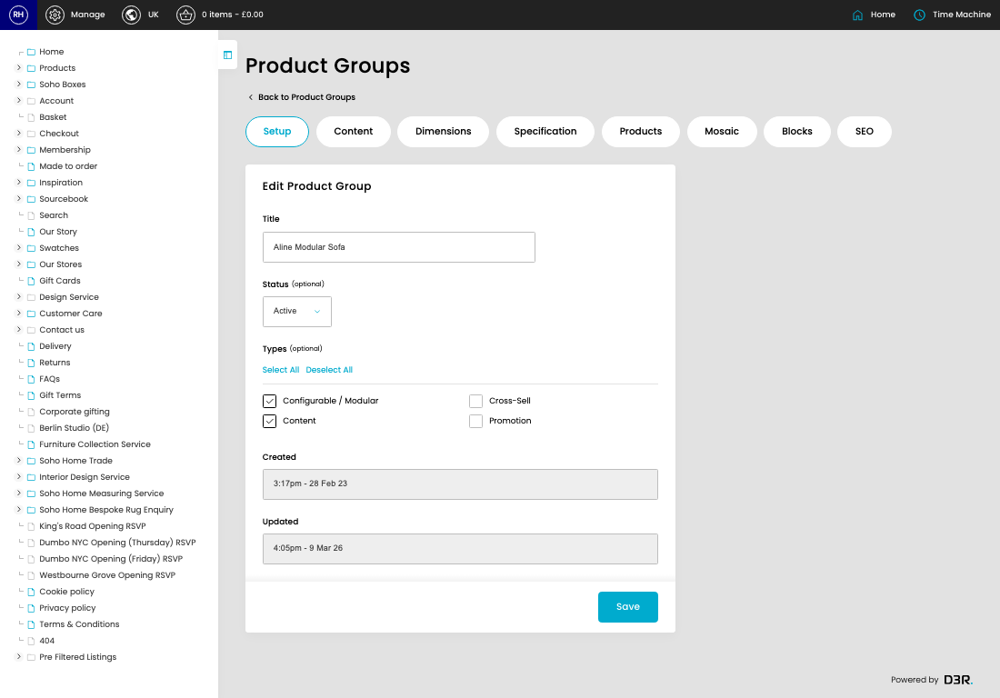
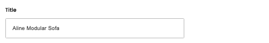
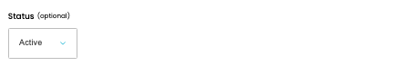

# Groups

[Home](../../index.md) / [Groups](../129-cp-product-groups-admin-f8f3e5c3/README.md) / Edit Group

URL: [https://sohohome.com/cp/product-groups-admin/edit/:id](https://sohohome.com/cp/product-groups-admin/edit/:id)

Product Group Class

*Groups page overview*

## Related Pages

- [Groups](../129-cp-product-groups-admin-f8f3e5c3/README.md): Search or filter the visible fields to find the group you need.

## How It Works

- After this has been updated.
- Refresh Action.
- The key fields are Description (Reimagined), Badge, Title, Intro, and Items, which explain what the record is for and how it can be used.

## Using This Page

1. Open the existing group you need to change.
2. Work through the fields that are relevant to the change.
3. Save once the details are correct.

## What You Can Do

### Edit an existing group

Open an existing group when you need to check the setup or make a change.

- Save once the details are correct.

## Key Settings

### Edit Product Group

#### Title

*Title setting*

Add the title.

**Validation:** Required.

#### Status (optional)

*Status (optional) setting*

Choose the option that matches this status (optional).

**Options:** Active, Inactive

**Notes:** optional

#### Configurable / Modular

Turn this on when configurable / modular should apply. Leave it off when it should not.

#### Content

Turn this on when content should apply. Leave it off when it should not.

#### Cross-Sell

Turn this on when cross-sell should apply. Leave it off when it should not.

#### Promotion

Turn this on when promotion should apply. Leave it off when it should not.

## Page Sections

- Setup
- Content
- Dimensions
- Specification
- Products
- Mosaic
- Blocks
- SEO
