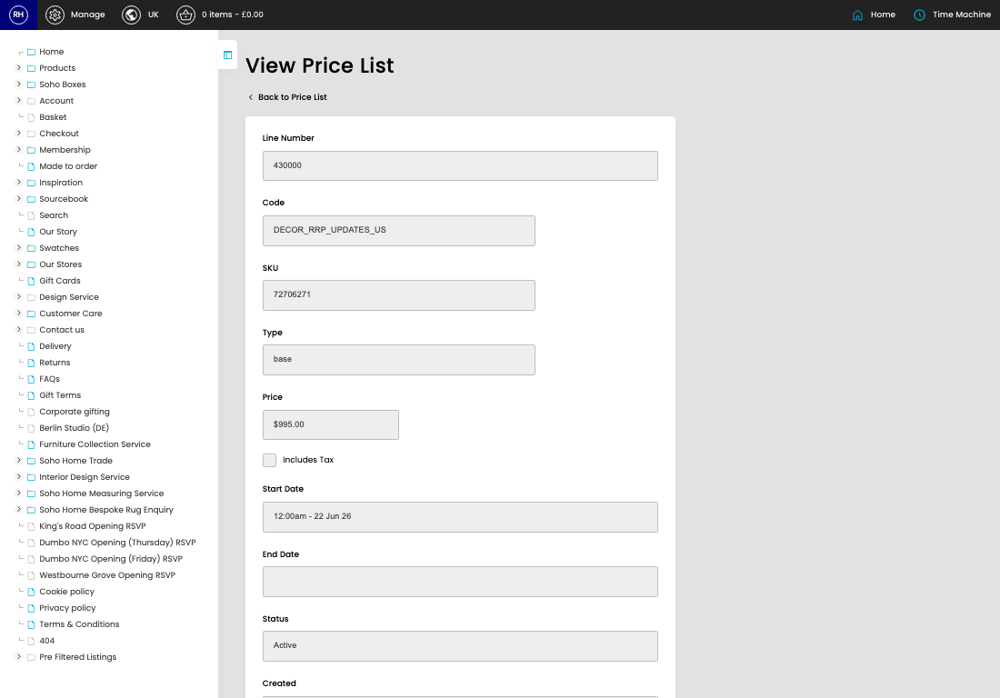
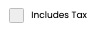

# Price Lists

[Home](../../index.md) / View Price List

URL: [https://sohohome.com/cp/product-price-list-admin/view/100224](https://sohohome.com/cp/product-price-list-admin/view/100224)

Price Lists covers the admin screen used to review and maintain price lists.

*Price Lists page overview*

## Related Pages

- [Price Lists](../131-cp-product-price-list-admin-d74e1406/README.md): Search or filter the visible fields to find the price list you need.

## How It Works

- After this has been updated.
- Refresh Action.
- The key fields are Line Number, Code, SKU, Type, and Price, which explain what the record is for and how it can be used.

## Using This Page

1. Open the existing price list you need to review.
2. Use the visible fields to check the details.

## What You Can Do

### Review an existing price list

Open an existing price list when you need to check the full details.

## Key Settings

### Price Lists

#### Includes Tax

*Includes Tax setting*

Turn this on when includes tax should apply. Leave it off when it should not.
