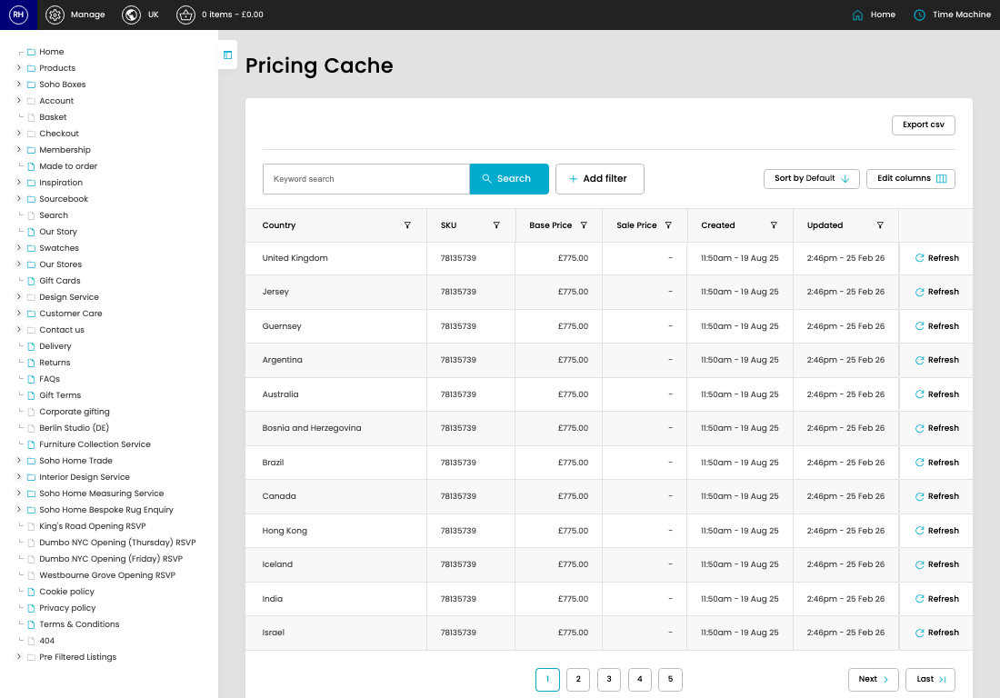

# Pricing Cache

[Home](../../index.md) / Pricing Cache

URL: [https://sohohome.com/cp/product-pricing-db-cache-admin](https://sohohome.com/cp/product-pricing-db-cache-admin)

Controller for DB Cache of current pricing

*Pricing Cache page overview*

## How It Works

- Refresh Action.
- After this has been updated.
- The key fields are Country, SKU, Base Price, and Sale Price, which explain what the record is for and how it can be used.

## Using This Page

1. Open Pricing Cache from the CP navigation.
2. Search or filter until you find the pricing cache you need.

## What You Can Do

### Review pricing cache

Search or filter the visible fields to find the pricing cache you need.

- Field: Country
- Field: SKU
- Field: Base Price
- Field: Sale Price
- Field: Created
- Field: Updated

Example rows:

| Country | SKU | Base Price | Sale Price | Created | Updated |
| --- | --- | --- | --- | --- | --- |
| United Kingdom | 78135739 | £775.00 | - | 11:50am - 19 Aug 25 | 2:46pm - 25 Feb 26 |
| Jersey | 78135739 | £775.00 | - | 11:50am - 19 Aug 25 | 2:46pm - 25 Feb 26 |
| Guernsey | 78135739 | £775.00 | - | 11:50am - 19 Aug 25 | 2:46pm - 25 Feb 26 |
