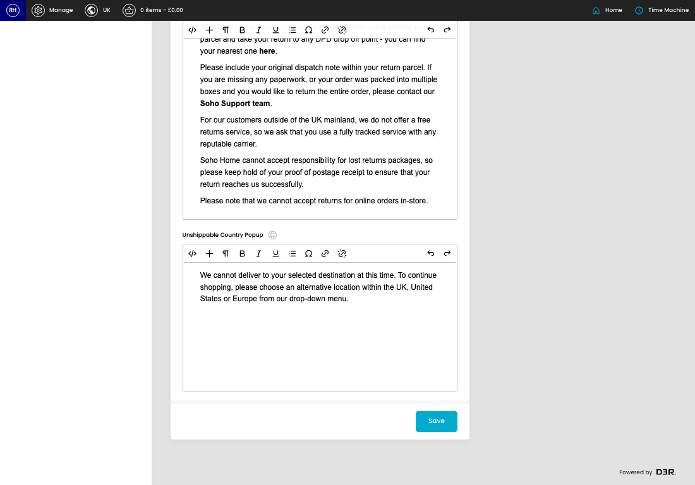

# Product settings

[Home](../../index.md) / Product Settings

URL: [https://sohohome.com/cp/product-settings-admin](https://sohohome.com/cp/product-settings-admin)

Manage site wide product settings

*Product settings page overview*

## How It Works

- After this has been updated.
- Refresh Action.
- The key fields are Delivery, Delivery (Reimagined), Returns (Reimagined), Unshippable Country Popup, and Categories Showing Arrangement CTAs, which explain what the record is for and how it can be used.

## Using This Page

1. Open the Product settings screen.
2. Work through the fields that are relevant to the change, then save once the details are correct.

## What You Can Do

### Update settings

Use the fields on this screen to make the change, then save once the values are correct.

## Key Settings

### Product Settings

#### Delivery

Write the delivery content.

#### Delivery (Reimagined)

Write the delivery (reimagined) content.

**Notes:** Content just for the delivery tab for Reimagined PDP

#### Returns (Reimagined)

Write the returns (reimagined) content.

**Notes:** Content just for the returns tab for Reimagined PDP

#### Unshippable Country Popup

Write the unshippable country popup content.

## Page Sections

- Delivery & Returns
- Import
- Stock
- Modular Settings
- Consolidation
- Membership Pop-up
- Pre Orders
- Made To Order Pop-up
- PDP About Us
- PDP Trade Benefits
- Shipping Information
- PDP Category Carousel
- Here To Help
