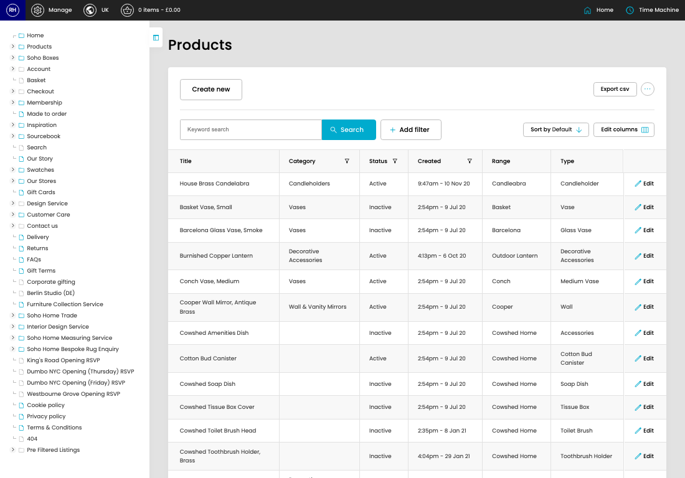

# Products

[Home](../../index.md) / Products

URL: [https://sohohome.com/cp/products-admin](https://sohohome.com/cp/products-admin)

Admin listing with visual merchandising added on

*Products page overview*

## Related Pages

- [Create Product](../136-cp-products-admin-edit-new-77b6c49c/README.md): Use Create new when this product does not already exist. Complete the fields that describe it, then save.

## How It Works

- The key fields are Title, Category, Google Category, Range, and Type, which explain what the record is for and how it can be used.

## Using This Page

1. Search or filter until you find the product you need.

## What You Can Do

### Review products

Search or filter the visible fields to find the product you need.

- Visible fields include Title, Category, Status, Created, Range, and Type.

Example rows:

| Title | Category | Status | Created | Range | Type |
| --- | --- | --- | --- | --- | --- |
| House Brass Candelabra | Candleholders | Active | 9:47am - 10 Nov 20 | Candleabra | Candleholder |
| Basket Vase, Small | Vases | Inactive | 2:54pm - 9 Jul 20 | Basket | Vase |
| Barcelona Glass Vase, Smoke | Vases | Inactive | 2:54pm - 9 Jul 20 | Barcelona | Glass Vase |
