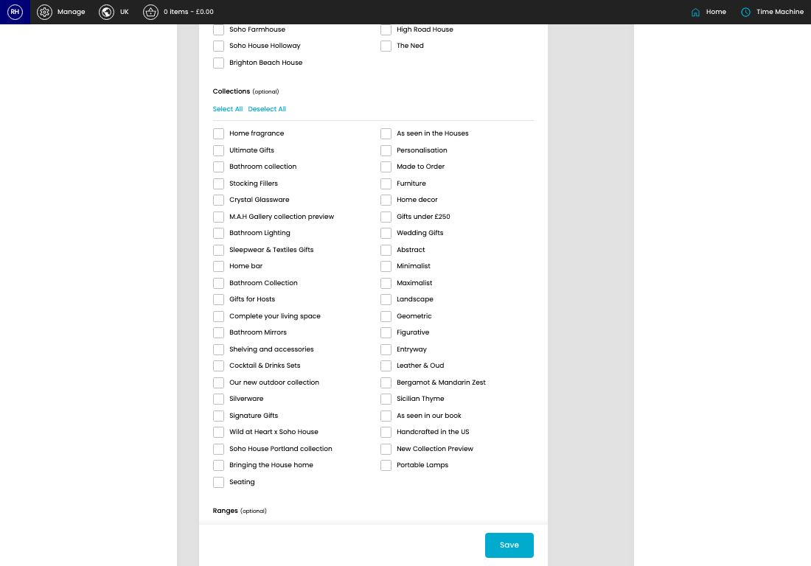
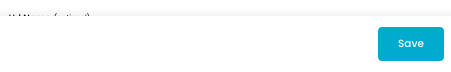

# Products

[Home](../../index.md) / [Products](../135-cp-products-admin-27f8eb6b/README.md) / Create Product

URL: [https://sohohome.com/cp/products-admin/edit/new](https://sohohome.com/cp/products-admin/edit/new)

Admin listing with visual merchandising added on

*Products page overview*

## Related Pages

- [Products](../135-cp-products-admin-27f8eb6b/README.md): Search or filter the visible fields to find the product you need.

## How It Works

- The key fields are Title, Category, Google Category, Range, and Type, which explain what the record is for and how it can be used.

## Using This Page

1. Create the new product from this screen.
2. Work through the fields that are relevant to the new record.
3. Save once the details are correct.

## What You Can Do

### Create a new product

Use Create new when this product does not already exist. Complete the fields that describe it, then save.

### Update settings

Use the fields on this screen to make the change, then save once the values are correct.

## Key Settings

The sections below highlight the settings people are most likely to change.

### Create New Product

#### Title

*Title setting*

Add the title.

**Validation:** Required.

#### Category (optional)

*Category (optional) setting*

Choose the option that matches this category (optional).

**Options:** Armchairs, Beds & Mattresses, Sofas, Coffee & Side Tables, Bar Cabinets & Barstools, Bedside Tables, Chest of Drawers & Wardrobes, Footstools, Ottomans & Benches, Dining Tables & Chairs, Sideboards & Media Units, Entryway, Consoles & Shelving, Wardrobes, Desks, and 17 more

**Notes:** optional

#### Url Name (optional)

*Url Name (optional) setting*

Add the url name (optional).

**Notes:** optional

#### Status

*Status setting*

Choose the option that matches this status.

**Options:** Active, Inactive

#### Is Module?

Turn this on when the answer should be yes. Leave it off when it should not apply.

#### Restriction UK (optional)

*Restriction UK (optional) setting*

Choose the option that matches this restriction UK (optional).

**Options:** Alcohol Restriction - UK, Knife Restriction, Unframed Artwork

**Notes:** optional

#### Restriction EU (optional)

*Restriction EU (optional) setting*

Choose the option that matches this restriction EU (optional).

**Options:** Alcohol Restriction - UK, Knife Restriction, Unframed Artwork

**Notes:** optional

#### Restriction US (optional)

*Restriction US (optional) setting*

Choose the option that matches this restriction US (optional).

**Options:** Alcohol Restriction - UK, Knife Restriction, Unframed Artwork

**Notes:** optional

#### Message UK (optional)

Choose the option that matches this message UK (optional).

**Options:** Heavy Furn, Personalisation, Variation in product, Wide access, UK & EU Marble Variations, US Marble Variations, Treviso, Railton Wardrobe Copy, Vintage Wear and Tear

**Notes:** optional

#### Message EU (optional)

Choose the option that matches this message EU (optional).

**Options:** Heavy Furn, Personalisation, Variation in product, Wide access, UK & EU Marble Variations, US Marble Variations, Treviso, Railton Wardrobe Copy, Vintage Wear and Tear

**Notes:** optional

#### Message US (optional)

Choose the option that matches this message US (optional).

**Options:** Heavy Furn, Personalisation, Variation in product, Wide access, UK & EU Marble Variations, US Marble Variations, Treviso, Railton Wardrobe Copy, Vintage Wear and Tear

**Notes:** optional

#### Variant 1 (optional)

Choose the option that matches this variant 1 (optional).

**Options:** Colour Group, Colour, Main Fabric, Main Material, Shape, Size, Trim, Wood Finish, Swatch

**Notes:** optional

#### Variant 2 (optional)

Choose the option that matches this variant 2 (optional).

**Options:** Colour Group, Colour, Main Fabric, Main Material, Shape, Size, Trim, Wood Finish, Swatch

**Notes:** optional

#### Variant 3 (optional)

Choose the option that matches this variant 3 (optional).

**Options:** Colour Group, Colour, Main Fabric, Main Material, Shape, Size, Trim, Wood Finish, Swatch

**Notes:** optional

#### product_google_category_autocomplete

Add the product_google_category_autocomplete.

**Notes:** optional

#### Range

Add the range.

**Validation:** Required.

#### Type

Add the type.

**Validation:** Required.

#### Featured in Sourcebook?

Turn this on when featured in sourcebook? should apply. Leave it off when it should not.

#### Soho House Manchester

Turn this on when soho house manchester should apply. Leave it off when it should not.

#### Barcelona Pool House

Turn this on when barcelona pool house should apply. Leave it off when it should not.

#### Ibiza Farmhouse

Turn this on when ibiza farmhouse should apply. Leave it off when it should not.

#### Soho House New York

Turn this on when soho house new york should apply. Leave it off when it should not.

#### Babington House

Turn this on when babington house should apply. Leave it off when it should not.

#### Soho House Barcelona

Turn this on when soho house barcelona should apply. Leave it off when it should not.

## Page Sections

- Product: Setup
- Upload Files
