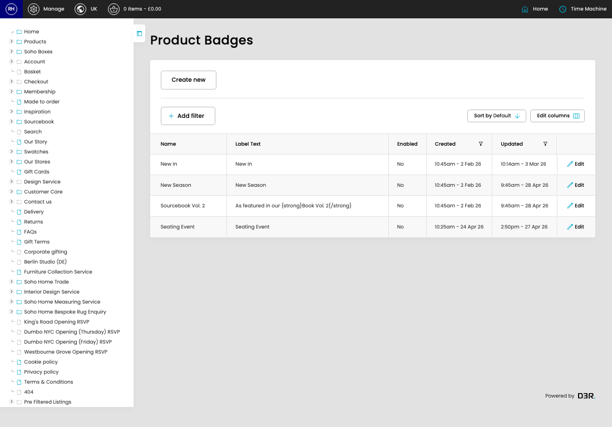

# Product Badges

[Home](../../index.md) / Product Badges

URL: [https://sohohome.com/cp/products-badges-admin](https://sohohome.com/cp/products-badges-admin)

Product Badges covers the admin screen used to review and maintain product badges.

*Product Badges page overview*

## Related Pages

- [Edit Product Badge](../138-cp-products-badges-admin-edit-1-7373ea4d/README.md): Open an existing product badge when you need to check the setup or make a change.

## How It Works

- The key fields are Name, Identifier, Label Text, Priority, and Enabled, which explain what the record is for and how it can be used.

## Using This Page

1. Open Product Badges from the CP navigation.
2. Scan the fields in the table to find the product badge you need.

## What You Can Do

### Review product badges

Review the visible fields to check what already exists.

- Field: Name
- Field: Label Text
- Field: Enabled
- Field: Created
- Field: Updated

Example rows:

| Name | Label Text | Enabled | Created | Updated |
| --- | --- | --- | --- | --- |
| New In | New In | No | 10:45am - 2 Feb 26 | 10:14am - 3 Mar 26 |
| New Season | New Season | No | 10:45am - 2 Feb 26 | 9:45am - 28 Apr 26 |
| Sourcebook Vol. 2 | As featured in our {strong}Book Vol. 2{/strong} | No | 10:45am - 2 Feb 26 | 9:45am - 28 Apr 26 |
