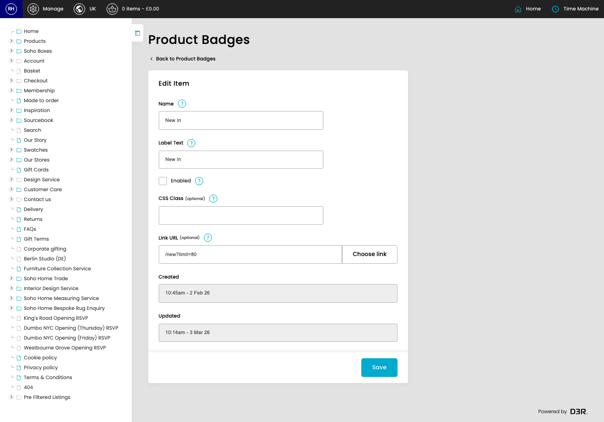
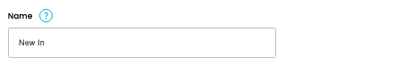
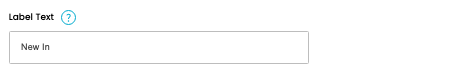
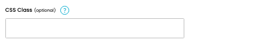
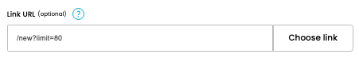

# Product Badges

[Home](../../index.md) / [Product Badges](../137-cp-products-badges-admin-d9a57942/README.md) / Edit Product Badge

URL: [https://sohohome.com/cp/products-badges-admin/edit/:id](https://sohohome.com/cp/products-badges-admin/edit/:id)

Badge manages product badge types (new-in, new-season, sourcebook, etc.)

*Product Badges page overview*

## Related Pages

- [Product Badges](../137-cp-products-badges-admin-d9a57942/README.md): Review the visible fields to check what already exists.

## How It Works

- The key fields are Name, Identifier, Label Text, Priority, and Enabled, which explain what the record is for and how it can be used.

## Using This Page

1. Open the existing product badge you need to change.
2. Work through the fields that are relevant to the change.
3. Save once the details are correct.

## What You Can Do

### Edit an existing product badge

Open an existing product badge when you need to check the setup or make a change.

- Save once the details are correct.

## Key Settings

### Edit Item

#### Name

*Name setting*

Add the name.

**Validation:** Required.

**Notes:** Internal name for the badge (e.g., "New In", "New Season")

#### Label Text

*Label Text setting*

Add the label text.

**Validation:** Required.

**Notes:** Text displayed on the badge (e.g., "New In", "New Season", "As featured in our {strong}Book Vol. 2{/strong}")

#### Enabled

Turn this on when enabled should apply. Leave it off when it should not.

**Notes:** Toggle to enable/disable this badge type globally

#### CSS Class (optional)

*CSS Class (optional) setting*

Add the CSS class (optional).

**Notes:** Optional CSS class for custom styling (defaults to product__badge-{slug})

#### Link URL (optional)

*Link URL (optional) setting*

Add the link URL (optional).

**Notes:** Optional URL to make badge clickable (e.g., /shop/new-in). Leave blank for non-clickable badge.

## Page Sections

- Choose link
