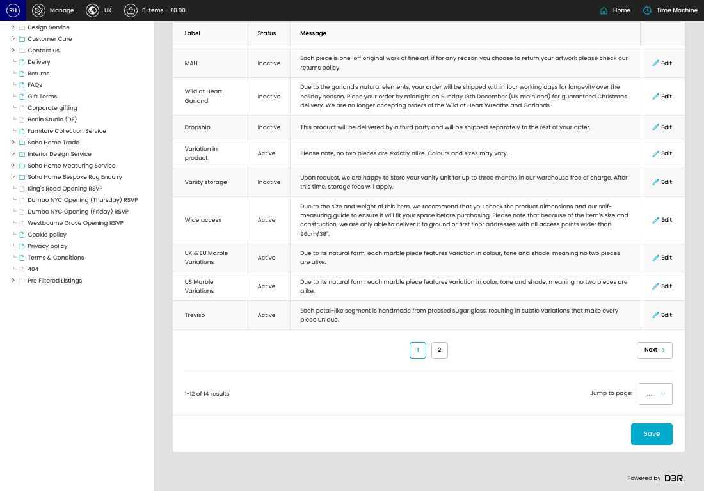

# Product Messages

[Home](../../index.md) / Product Messages

URL: [https://sohohome.com/cp/products-messages-admin](https://sohohome.com/cp/products-messages-admin)

Product Message Model Class

*Product Messages page overview*

## Related Pages

- [Edit Product Message](../140-cp-products-messages-admin-edit-id-1417df6e/README.md): Open an existing product message when you need to check the setup or make a change.

## How It Works

- After this has been updated.
- Refresh Action.
- The key fields are Label, Status, Message, Countries to Message, and UK Products, which explain what the record is for and how it can be used.

## Using This Page

1. Scan the fields in the table to find the product message you need.

## What You Can Do

### Review product messages

Review the visible fields to check what already exists.

- Visible fields include Label, Status, and Message.

Example rows:

| Label | Status | Message |
| --- | --- | --- |
| Heavy Furn | Active | Due to the size & weight of this item, we recommend that you check the product dimensions  |
| Personalisation | Active | Our personalisation service allows you to embroider up to 3 initials, symbols and numbers  |
| Wild at Heart Wreath | Inactive | Due to the wreath's natural elements, your order will be shipped within four working days  |

### Update settings

Use the fields on this screen to make the change, then save once the values are correct.
