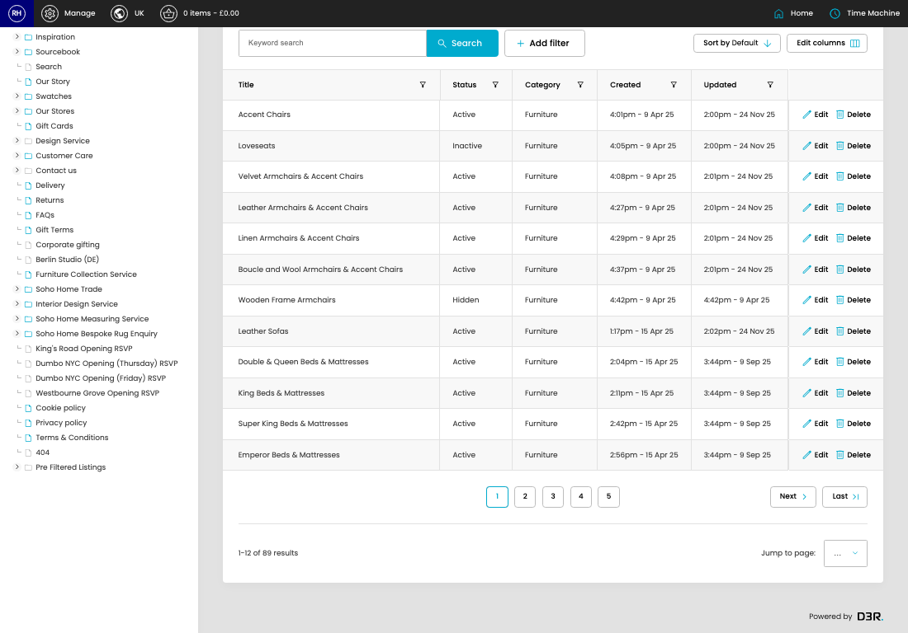

# Pre-Filtered Listings

[Home](../../index.md) / Pre-Filtered Listings

URL: [https://sohohome.com/cp/products-pre-filtered-listing-admin](https://sohohome.com/cp/products-pre-filtered-listing-admin)

Custom made product listings.

*Pre-Filtered Listings page overview*

## Related Pages

- [Create Pre-Filtered Listing](../142-cp-products-pre-filtered-listing-admin-edit-new-c6f8d348/README.md): Use Create new when this pre-filtered listing does not already exist. Complete the fields that describe it, then save.

## How It Works

- The key fields are Title, Url name, Status, Category, and Intro, which explain what the record is for and how it can be used.

## Using This Page

1. Open Pre-Filtered Listings from the CP navigation.
2. Search or filter until you find the pre-filtered listing you need.

## What You Can Do

### Review pre-filtered listings

Search or filter the visible fields to find the pre-filtered listing you need.

- Field: Title
- Field: Status
- Field: Category
- Field: Created
- Field: Updated

Example rows:

| Title | Status | Category | Created | Updated |
| --- | --- | --- | --- | --- |
| Accent Chairs | Active | Furniture | 4:01pm - 9 Apr 25 | 2:00pm - 24 Nov 25 |
| Loveseats | Inactive | Furniture | 4:05pm - 9 Apr 25 | 2:00pm - 24 Nov 25 |
| Velvet Armchairs & Accent Chairs | Active | Furniture | 4:08pm - 9 Apr 25 | 2:01pm - 24 Nov 25 |

## Available Actions

- Import csv
