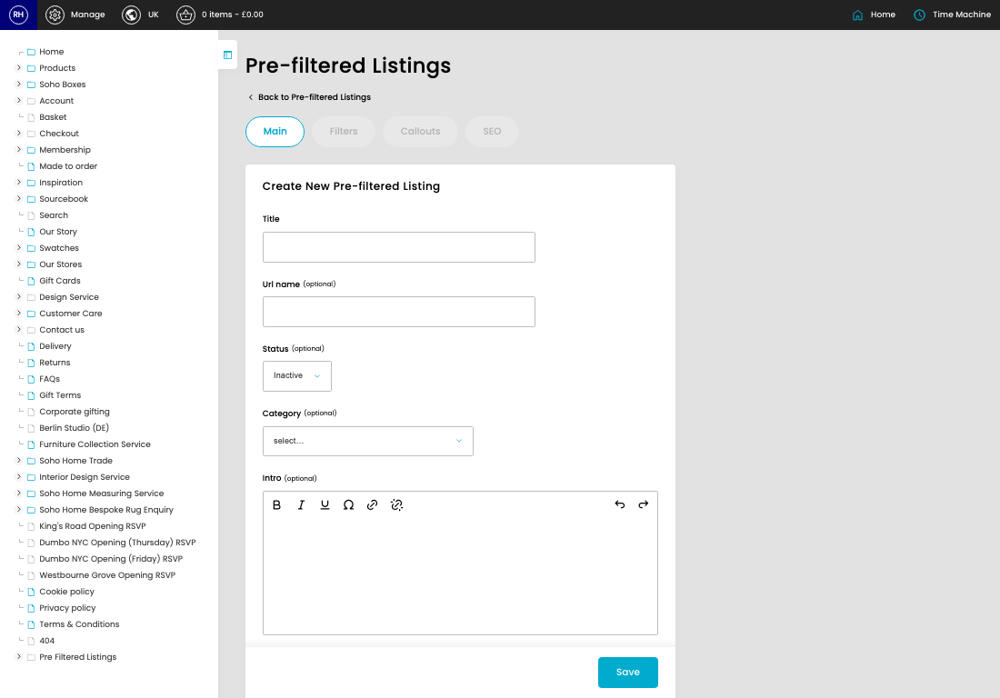
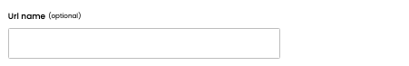
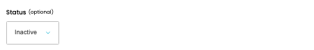
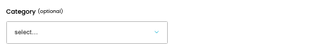

# Pre-Filtered Listings

[Home](../../index.md) / Create Pre-Filtered Listing

URL: [https://sohohome.com/cp/products-pre-filtered-listing-admin/edit/new](https://sohohome.com/cp/products-pre-filtered-listing-admin/edit/new)

Custom made product listings.

*Pre-Filtered Listings page overview*

## Related Pages

- [Pre-Filtered Listings](../141-cp-products-pre-filtered-listing-admin-ff16326d/README.md): Search or filter the visible fields to find the pre-filtered listing you need.

## How It Works

- The key fields are Title, Url name, Status, Category, and Intro, which explain what the record is for and how it can be used.

## Using This Page

1. Create the new pre-filtered listing from this screen.
2. Work through the fields that are relevant to the new record.
3. Save once the details are correct.

## What You Can Do

### Create a new pre-filtered listing

Use Create new when this pre-filtered listing does not already exist. Complete the fields that describe it, then save.

### Update settings

Use the fields on this screen to make the change, then save once the values are correct.

## Key Settings

### Create New Pre-filtered Listing

#### Title

*Title setting*

Add the title.

**Validation:** Required.

#### Url name (optional)

*Url name (optional) setting*

Add the url name (optional).

**Notes:** optional

#### Status (optional)

*Status (optional) setting*

Choose the option that matches this status (optional).

**Options:** Active, Hidden, Inactive

**Notes:** optional

#### Category (optional)

*Category (optional) setting*

Choose the option that matches this category (optional).

**Options:** Furniture, Bathroom, Outdoor, Textiles, Lighting, Dining, Home Fragrance, Mirrors & Decor, Art, Home fragrance, Ultimate Gifts, Bathroom collection, and 17 more

**Notes:** optional

#### Intro (optional)

*Intro (optional) setting*

Write the intro (optional) content.

## Available Actions

- Main
