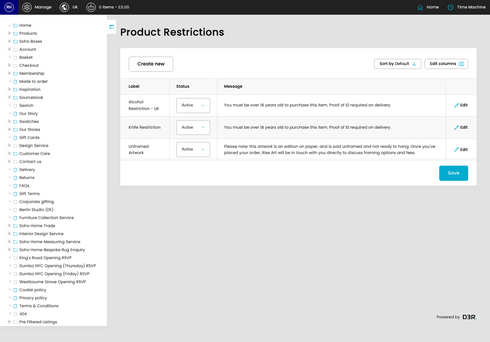
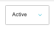

# Product Restrictions

[Home](../../index.md) / Product Restrictions

URL: [https://sohohome.com/cp/products-restrictions-admin](https://sohohome.com/cp/products-restrictions-admin)

Product Restrictions covers the admin screen used to review and maintain product restrictions.

*Product Restrictions page overview*

## Related Pages

- [Edit Product Restriction](../144-cp-products-restrictions-admin-edit-1-f63d5328/README.md): Open an existing product restriction when you need to check the setup or make a change.

## How It Works

- After this has been updated.
- Refresh Action.
- The key fields are Label, Status, Message, Restricted Countries, and UK Products, which explain what the record is for and how it can be used.

## Using This Page

1. Open Product Restrictions from the CP navigation.
2. Scan the fields in the table to find the product restriction you need.

## What You Can Do

### Review product restrictions

Review the visible fields to check what already exists.

- Field: Label
- Field: Status
- Field: Message

Example rows:

| Label | Status | Message |
| --- | --- | --- |
| Alcohol Restriction - UK | Active Inactive | You must be over 18 years old to purchase this item. Proof of ID required on delivery. |
| Knife Restriction | Active Inactive | You must be over 18 years old to purchase this item. Proof of ID required on delivery. |
| Unframed Artwork | Active Inactive | Please note: this artwork is an edition on paper, and is sold unframed and not ready to ha |

### Update settings

Use the fields on this screen to make the change, then save once the values are correct.

## Key Settings

The sections below highlight the settings people are most likely to change.

### listing-product_restriction-form

#### Restriction Status

*Restriction Status setting*

Set the Restriction Status value for each relevant row in this section.

**Options:** Active, Inactive
